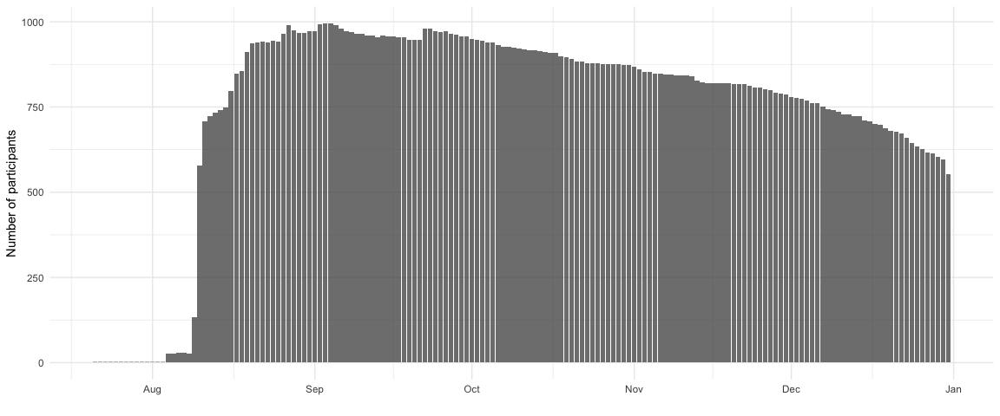
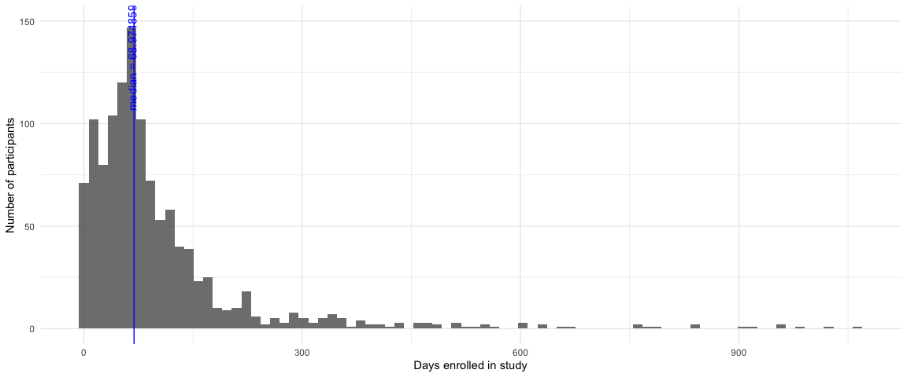
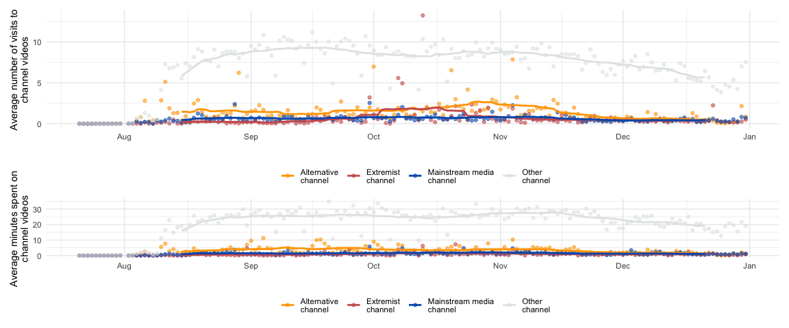
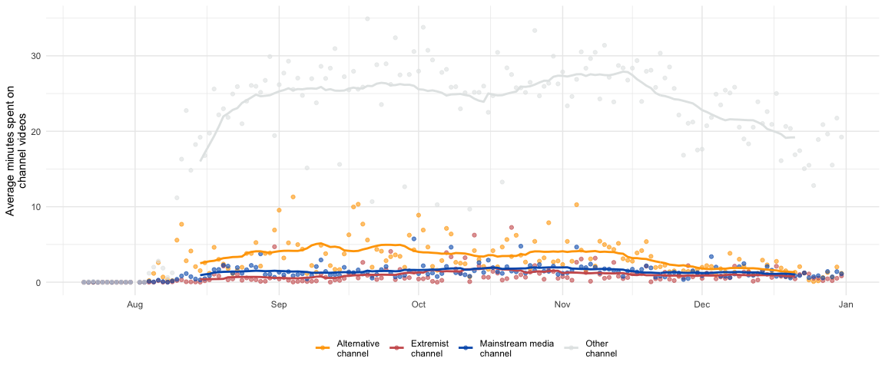
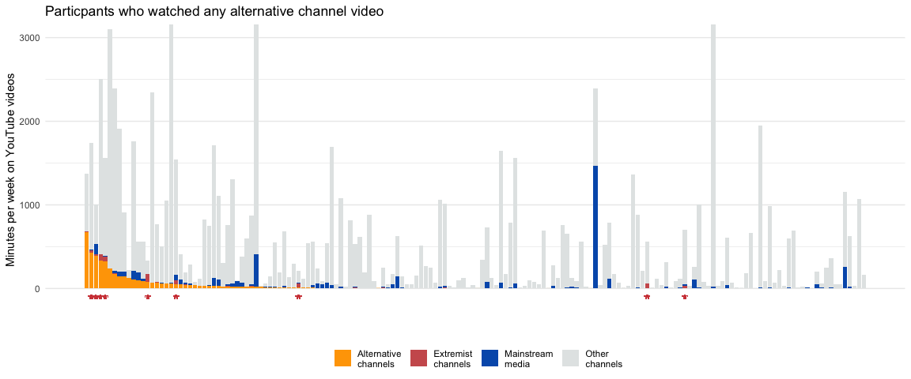
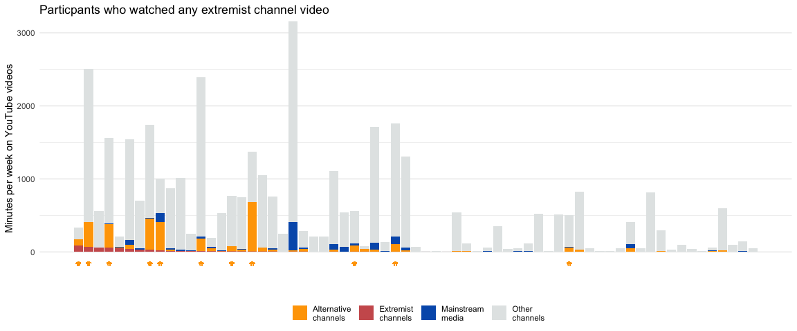

Appendix Tables and Figures
================

  - [Table A1: Demographic statistics by
    sample](#table-a1-demographic-statistics-by-sample)
  - [Figure A1: Total participants with browser activity data over
    time](#figure-a1-total-participants-with-browser-activity-data-over-time)
  - [Figure A2: Coonsumption levels over time by channel
    type](#figure-a2-coonsumption-levels-over-time-by-channel-type)
  - [Figure A3 and A4: YouTube video diets of individuals who viewed any
    alternative/extremist channel
    video](#figure-a3-and-a4-youtube-video-diets-of-individuals-who-viewed-any-alternativeextremist-channel-video)
  - [Figure A7 and A8:](#figure-a7-and-a8)
      - [Figure A7: Correlates of YouTube video exposure by channel type
        (with party
        controls)](#figure-a7-correlates-of-youtube-video-exposure-by-channel-type-with-party-controls)
      - [Table A7: Hostile sexism and Racial resentment
        specifications](#table-a7-hostile-sexism-and-racial-resentment-specifications)
      - [Figure A8: Correlates of exposure to YouTube videos by channel
        type (alternate racial attitude
        measure)](#figure-a8-correlates-of-exposure-to-youtube-videos-by-channel-type-alternate-racial-attitude-measure)
  - [Figure A5: Zero-inflated models on correlates of time on YouTube
    video by channel
    type](#figure-a5-zero-inflated-models-on-correlates-of-time-on-youtube-video-by-channel-type)
  - [Figure A6: Correlates of YouTube video views by channel
    type](#figure-a6-correlates-of-youtube-video-views-by-channel-type)
  - [Figure A9: Correlation between browser history and
    activity](#figure-a9-correlation-between-browser-history-and-activity)
  - [Table A8: Predictors of proportion of time spent on
    alternative/extremist videos by
    day](#table-a8-predictors-of-proportion-of-time-spent-on-alternativeextremist-videos-by-day)
  - [Figure A10: Differences in perceptions of YouTube between full
    sample and extension
    sample](#figure-a10-differences-in-perceptions-of-youtube-between-full-sample-and-extension-sample)
  - [Figure A11: Percentage of views to each channel type by video
    number within
    session](#figure-a11-percentage-of-views-to-each-channel-type-by-video-number-within-session)
  - [Figure A12: Percentage of views to each channel type by total
    session
    length](#figure-a12-percentage-of-views-to-each-channel-type-by-total-session-length)
  - [Table A9: External referrers to alternative and extremist channel
    videos](#table-a9-external-referrers-to-alternative-and-extremist-channel-videos)
  - [Figure A13: Concentration of exposure to alternative and extremist
    channels (view
    counts)](#figure-a13-concentration-of-exposure-to-alternative-and-extremist-channels-view-counts)

``` r
### ----------- data
# survey + extension data for individuals
merged_data <- read_rds("data/yg_browser_cces_merged.rds")
# activity data
activity_data <- read_rds("data/activity_yg_cces.rds") 
# over time data for consumption over time
at_over_time <- read_rds("data/activity_time_user_by_date.rds")
at_over_views <- read_rds("data/activity_count_user_by_date.rds")

# color palette 
color_palette <- c("#FFA500", "#CD5C5C", "#015CB9", "#E3E6E6")
```

## Table A1: Demographic statistics by sample

``` r
# select variables of interest
demo_vars <- c(
  'gender',
  'race',
  'presvote16post',
  'employ',
  'educ2',
  'religion',
  'marital',
  'faminc_new',
  'pid3',
  'age_group'
)
demographics_data <- merged_data %>%
  dplyr::select(weight_cmd, all_of(demo_vars), browser_sample) %>%
  fastDummies::dummy_cols(select_columns = all_of(demo_vars))
# level of each variable
var_levels <- demographics_data %>% 
  dplyr::select(-demo_vars, -weight_cmd, -browser_sample) %>% 
  names()

# function to calculate (un)weighted stats depending on sample
weighted_stats_fxn <- function (var, sample) {
  require(TAM)
  require(diagis)
  if (sample == "full") {
    d <- # take non-null in variable
      demographics_data[complete.cases(demographics_data[[var]], demographics_data$weight_cmd), , drop =
                          FALSE][[var]]
    w <-
      demographics_data$weight_cmd[complete.cases(demographics_data[[var]],  demographics_data$weight_cmd)]
  } else if (sample == "browser") {
    d <- # non-Nulls in extension sample
      demographics_data[complete.cases(demographics_data[[var]], demographics_data$weight_cmd) &
                          demographics_data$browser_sample == "browser", , drop = FALSE][[var]]
    w <-
      demographics_data$weight_cmd[complete.cases(demographics_data[[var]],  demographics_data$weight_cmd) &
                                     demographics_data$browser_sample == "browser"]
  }
  out <- data.frame(
    "variable" = str_split(string = var, pattern = "_(?=[^_]+$)")[[1]][1] ,
    "level" = str_split(string = var, pattern = "_(?=[^_]+$)")[[1]][2] ,
    "n" = length(d),
    "unweighted_mean" = mean(d, na.rm = T),
    "weighted_mean" = TAM::weighted_mean(d, w = w),
    "unweighted_se" = sd(d, na.rm = T) / sqrt(length(d)),
    "weighted_se" = diagis::weighted_se(d, w = w, na.rm = TRUE),
    "sample" = sample
  )
  return(out)
}

# function to format table
custom_kable_weighted <- function(data, 
                                  col_names = c("", "Weighted", "Unweighted")) {
  kbl(
    data %>% dplyr::select(-variable),
    booktabs = TRUE,
    caption = "Full and extension sample demographics",
    format = "html",
    align = "c",
    digits = 2,
    linesep = "",
    col.names = col_names
  )  %>%
    kable_styling(latex_options =  "HOLD_position",
                  font_size = 10,
                  #bootstrap_options = c("striped","condensed"),
                  stripe_index = c(1, 5, 13, 17, 21, 29, 35, 41, 51, 57)) %>%
    group_rows("Gender", 1, 4,
               background = "gray!6",
               latex_gap_space = "0em") %>%
    group_rows("Race", 5, 8,
               background = "gray!6",
               latex_gap_space = "0em") %>%
    group_rows("2016 presidential vote", 9, 12,
               background = "gray!6",
               latex_gap_space = "0em") %>%
    group_rows("Employment status", 13, 16,
               background = "gray!6",
               latex_gap_space = "0em") %>%
    group_rows("Education", 16, 24,
               background = "gray!6",
               latex_gap_space = "0em") %>%
    group_rows("Religion", 25, 30,
               background = "gray!6",
               latex_gap_space = "0em") %>%
    group_rows("Marital status", 31, 36,
               background = "gray!6",
               latex_gap_space = "0em") %>%
    group_rows("Family income", 37, 46,
               background = "gray!6",
               latex_gap_space = "0em") %>%
    group_rows("Party identification", 47, 52,
               background = "gray!6",
               latex_gap_space = "0em") %>%
    group_rows("Age", 53, 60,
               background = "gray!6",
               latex_gap_space = "0em") %>% 
    footnote(
      c("Weighted estimates use YouGov survey weights.",
        "Standard errors are in parentheses."))%>%
    row_spec(61, extra_latex_after = "\\cline{3-4}")%>%
    row_spec(62, hline_after = TRUE)
}
```

``` r
# get (un)weighted estimates for extension sample
browser_sample <-
  map(var_levels, ~weighted_stats_fxn(.x, sample = "browser"))
# get (un)weighted estimates for full survey sample
full_sample <-
  map(var_levels, ~weighted_stats_fxn(.x, sample = "full"))

# merge full and extension estimates together
demographic_stats_table <- browser_sample %>%
  bind_rows() %>%
  left_join(
    bind_rows(full_sample),
    by = c("variable", "level"),
    suffix = c(".browser", ".full")
  ) %>%
  mutate_at(
    vars(
      starts_with("unweighted_"),
      starts_with("weighted_")
    ),
    list( ~ format(round(., 2), nsmall = 2) )
  )

# number of respondents in survey sample
n_full <- 
  demographics_data %>% 
  nrow()
# number of respondents in extension sample
n_browser <- 
  demographics_data %>% 
  filter(browser_sample == "browser") %>% 
  nrow()
```

``` r
# reformat 
full_summ <- demographic_stats_table %>%
  dplyr::select(
    variable,
    level,
    weighted_mean.full,
    weighted_se.full,
    unweighted_mean.full,
    unweighted_se.full
  ) %>%
  mutate(
    unweighted_se.full = paste0("(", as.character(unweighted_se.full), ")"),
    weighted_se.full = paste0("(", as.character(weighted_se.full), ")"),
    weighted_mean.full = as.character(weighted_mean.full),
    unweighted_mean.full  = as.character(unweighted_mean.full)
  ) %>%
  pivot_longer(c(
    weighted_mean.full,
    weighted_se.full,
    unweighted_mean.full,
    unweighted_se.full
  )) %>%
  mutate(weighted = ifelse(str_detect(name, "unweighted"), "unweighted", "weighted")) %>%
  pivot_wider(-c(value), weighted) %>%
  mutate(
    weighted = ifelse(is.na(weighted), lag(weighted, n = 2L), weighted),
    unweighted = ifelse(is.na(unweighted), lead(unweighted, n = 2L), unweighted)
  ) %>%
  filter(str_detect(name, "unweighted")) %>% 
  filter(level != "NA" & level != "Other") %>% 
  select(-name) %>%
  mutate(level = ifelse(1:length(.$level) %% 2 == 0, "", level)) %>%
  add_row(
    variable = "",
    level = "",
    weighted = paste0("n = ", n_full),
    unweighted = paste0("n = ", n_full)
  ) 

# extension sample
browser_summ <- demographic_stats_table %>%
  dplyr::select(
    variable,
    level,
    weighted_mean.browser,
    weighted_se.browser,
    unweighted_mean.browser,
    unweighted_se.browser
  ) %>%
  mutate(
    unweighted_se.browser = paste0("(", as.character(unweighted_se.browser), ")"),
    weighted_se.browser = paste0("(", as.character(weighted_se.browser), ")"),
    weighted_mean.browser = as.character(weighted_mean.browser),
    unweighted_mean.browser  = as.character(unweighted_mean.browser)
  ) %>%
  pivot_longer(
    c(
      weighted_mean.browser,
      weighted_se.browser,
      unweighted_mean.browser,
      unweighted_se.browser
    )
  ) %>%
  mutate(weighted = ifelse(str_detect(name, "unweighted"), "unweighted", "weighted")) %>%
  pivot_wider(-c(value), weighted) %>%
  mutate(
    weighted = ifelse(is.na(weighted), lag(weighted, n = 2L), weighted),
    unweighted = ifelse(is.na(unweighted), lead(unweighted, n = 2L), unweighted)
  ) %>%
  filter(str_detect(name, "unweighted")) %>%
  filter(level != "NA" & level != "Other") %>% 
  select(-name) %>%
  mutate(level = ifelse(1:length(.$level) %% 2 == 0, "", level)) %>%
  add_row(
    variable = "",
    level = "",
    weighted = paste0("n = ", n_browser),
    unweighted = paste0("n = ", n_browser)
  )

# put full and extension sample tables together...
combined_table <- full_summ %>%
  rename(full_weighted = weighted,
         full_unweighted = unweighted) %>%
  bind_cols(
    browser_summ %>%
      rename(
        extension_weighted = weighted,
        extension_unweighted = unweighted
      ) %>% 
      select(-variable, -level)
  )

# print table
custom_kable_weighted(combined_table,
                      col_names = c("", "Full weighted", "Full unweighted", 
                                    "Extension weighted", "Extension unweighted"))
```

<table class="table" style="font-size: 10px; margin-left: auto; margin-right: auto;">

<caption style="font-size: initial !important;">

Full and extension sample demographics

</caption>

<thead>

<tr>

<th style="text-align:center;">

</th>

<th style="text-align:center;">

Full weighted

</th>

<th style="text-align:center;">

Full unweighted

</th>

<th style="text-align:center;">

Extension weighted

</th>

<th style="text-align:center;">

Extension unweighted

</th>

</tr>

</thead>

<tbody>

<tr grouplength="4">

<td colspan="5" style="border-bottom: 1px solid;background-color: gray!6 !important;">

<strong>Gender</strong>

</td>

</tr>

<tr>

<td style="text-align:center; padding-left:  2em;" indentlevel="1">

Female

</td>

<td style="text-align:center;">

0.48

</td>

<td style="text-align:center;">

0.46

</td>

<td style="text-align:center;">

0.49

</td>

<td style="text-align:center;">

0.49

</td>

</tr>

<tr>

<td style="text-align:center; padding-left:  2em;" indentlevel="1">

</td>

<td style="text-align:center;">

(0.01)

</td>

<td style="text-align:center;">

(0.01)

</td>

<td style="text-align:center;">

(0.02)

</td>

<td style="text-align:center;">

(0.01)

</td>

</tr>

<tr>

<td style="text-align:center; padding-left:  2em;" indentlevel="1">

Male

</td>

<td style="text-align:center;">

0.52

</td>

<td style="text-align:center;">

0.54

</td>

<td style="text-align:center;">

0.51

</td>

<td style="text-align:center;">

0.51

</td>

</tr>

<tr>

<td style="text-align:center; padding-left:  2em;" indentlevel="1">

</td>

<td style="text-align:center;">

(0.01)

</td>

<td style="text-align:center;">

(0.01)

</td>

<td style="text-align:center;">

(0.02)

</td>

<td style="text-align:center;">

(0.01)

</td>

</tr>

<tr grouplength="4">

<td colspan="5" style="border-bottom: 1px solid;background-color: gray!6 !important;">

<strong>Race</strong>

</td>

</tr>

<tr>

<td style="text-align:center; padding-left:  2em;" indentlevel="1">

White

</td>

<td style="text-align:center;">

0.68

</td>

<td style="text-align:center;">

0.76

</td>

<td style="text-align:center;">

0.69

</td>

<td style="text-align:center;">

0.75

</td>

</tr>

<tr>

<td style="text-align:center; padding-left:  2em;" indentlevel="1">

</td>

<td style="text-align:center;">

(0.01)

</td>

<td style="text-align:center;">

(0.01)

</td>

<td style="text-align:center;">

(0.02)

</td>

<td style="text-align:center;">

(0.01)

</td>

</tr>

<tr>

<td style="text-align:center; padding-left:  2em;" indentlevel="1">

Non-white

</td>

<td style="text-align:center;">

0.32

</td>

<td style="text-align:center;">

0.24

</td>

<td style="text-align:center;">

0.31

</td>

<td style="text-align:center;">

0.25

</td>

</tr>

<tr>

<td style="text-align:center; padding-left:  2em;" indentlevel="1">

</td>

<td style="text-align:center;">

(0.01)

</td>

<td style="text-align:center;">

(0.01)

</td>

<td style="text-align:center;">

(0.02)

</td>

<td style="text-align:center;">

(0.01)

</td>

</tr>

<tr grouplength="4">

<td colspan="5" style="border-bottom: 1px solid;background-color: gray!6 !important;">

<strong>2016 presidential vote</strong>

</td>

</tr>

<tr>

<td style="text-align:center; padding-left:  2em;" indentlevel="1">

Donald Trump

</td>

<td style="text-align:center;">

0.33

</td>

<td style="text-align:center;">

0.40

</td>

<td style="text-align:center;">

0.19

</td>

<td style="text-align:center;">

0.20

</td>

</tr>

<tr>

<td style="text-align:center; padding-left:  2em;" indentlevel="1">

</td>

<td style="text-align:center;">

(0.01)

</td>

<td style="text-align:center;">

(0.01)

</td>

<td style="text-align:center;">

(0.02)

</td>

<td style="text-align:center;">

(0.01)

</td>

</tr>

<tr>

<td style="text-align:center; padding-left:  2em;" indentlevel="1">

Hillary Clinton

</td>

<td style="text-align:center;">

0.28

</td>

<td style="text-align:center;">

0.31

</td>

<td style="text-align:center;">

0.40

</td>

<td style="text-align:center;">

0.49

</td>

</tr>

<tr>

<td style="text-align:center; padding-left:  2em;" indentlevel="1">

</td>

<td style="text-align:center;">

(0.01)

</td>

<td style="text-align:center;">

(0.01)

</td>

<td style="text-align:center;">

(0.02)

</td>

<td style="text-align:center;">

(0.01)

</td>

</tr>

<tr grouplength="4">

<td colspan="5" style="border-bottom: 1px solid;background-color: gray!6 !important;">

<strong>Employment status</strong>

</td>

</tr>

<tr>

<td style="text-align:center; padding-left:  2em;" indentlevel="1">

Employed

</td>

<td style="text-align:center;">

0.46

</td>

<td style="text-align:center;">

0.49

</td>

<td style="text-align:center;">

0.48

</td>

<td style="text-align:center;">

0.51

</td>

</tr>

<tr>

<td style="text-align:center; padding-left:  2em;" indentlevel="1">

</td>

<td style="text-align:center;">

(0.01)

</td>

<td style="text-align:center;">

(0.01)

</td>

<td style="text-align:center;">

(0.02)

</td>

<td style="text-align:center;">

(0.01)

</td>

</tr>

<tr>

<td style="text-align:center; padding-left:  2em;" indentlevel="1">

Unemployed

</td>

<td style="text-align:center;">

0.12

</td>

<td style="text-align:center;">

0.10

</td>

<td style="text-align:center;">

0.12

</td>

<td style="text-align:center;">

0.10

</td>

</tr>

<tr grouplength="9">

<td colspan="5" style="border-bottom: 1px solid;background-color: gray!6 !important;">

<strong>Education</strong>

</td>

</tr>

<tr>

<td style="text-align:center; padding-left:  2em;" indentlevel="2">

</td>

<td style="text-align:center;">

(0.01)

</td>

<td style="text-align:center;">

(0.00)

</td>

<td style="text-align:center;">

(0.02)

</td>

<td style="text-align:center;">

(0.01)

</td>

</tr>

<tr>

<td style="text-align:center; padding-left:  2em;" indentlevel="1">

High school graduate

</td>

<td style="text-align:center;">

0.35

</td>

<td style="text-align:center;">

0.19

</td>

<td style="text-align:center;">

0.26

</td>

<td style="text-align:center;">

0.14

</td>

</tr>

<tr>

<td style="text-align:center; padding-left:  2em;" indentlevel="1">

</td>

<td style="text-align:center;">

(0.01)

</td>

<td style="text-align:center;">

(0.01)

</td>

<td style="text-align:center;">

(0.02)

</td>

<td style="text-align:center;">

(0.01)

</td>

</tr>

<tr>

<td style="text-align:center; padding-left:  2em;" indentlevel="1">

Some college

</td>

<td style="text-align:center;">

0.35

</td>

<td style="text-align:center;">

0.37

</td>

<td style="text-align:center;">

0.37

</td>

<td style="text-align:center;">

0.35

</td>

</tr>

<tr>

<td style="text-align:center; padding-left:  2em;" indentlevel="1">

</td>

<td style="text-align:center;">

(0.01)

</td>

<td style="text-align:center;">

(0.01)

</td>

<td style="text-align:center;">

(0.02)

</td>

<td style="text-align:center;">

(0.01)

</td>

</tr>

<tr>

<td style="text-align:center; padding-left:  2em;" indentlevel="1">

4-year

</td>

<td style="text-align:center;">

0.19

</td>

<td style="text-align:center;">

0.26

</td>

<td style="text-align:center;">

0.24

</td>

<td style="text-align:center;">

0.28

</td>

</tr>

<tr>

<td style="text-align:center; padding-left:  2em;" indentlevel="1">

</td>

<td style="text-align:center;">

(0.01)

</td>

<td style="text-align:center;">

(0.01)

</td>

<td style="text-align:center;">

(0.02)

</td>

<td style="text-align:center;">

(0.01)

</td>

</tr>

<tr>

<td style="text-align:center; padding-left:  2em;" indentlevel="1">

Post-grad

</td>

<td style="text-align:center;">

0.11

</td>

<td style="text-align:center;">

0.18

</td>

<td style="text-align:center;">

0.13

</td>

<td style="text-align:center;">

0.23

</td>

</tr>

<tr>

<td style="text-align:center; padding-left:  2em;" indentlevel="1">

</td>

<td style="text-align:center;">

(0.01)

</td>

<td style="text-align:center;">

(0.01)

</td>

<td style="text-align:center;">

(0.01)

</td>

<td style="text-align:center;">

(0.01)

</td>

</tr>

<tr grouplength="6">

<td colspan="5" style="border-bottom: 1px solid;background-color: gray!6 !important;">

<strong>Religion</strong>

</td>

</tr>

<tr>

<td style="text-align:center; padding-left:  2em;" indentlevel="1">

Atheist/Agnostic

</td>

<td style="text-align:center;">

0.37

</td>

<td style="text-align:center;">

0.35

</td>

<td style="text-align:center;">

0.47

</td>

<td style="text-align:center;">

0.46

</td>

</tr>

<tr>

<td style="text-align:center; padding-left:  2em;" indentlevel="1">

</td>

<td style="text-align:center;">

(0.01)

</td>

<td style="text-align:center;">

(0.01)

</td>

<td style="text-align:center;">

(0.02)

</td>

<td style="text-align:center;">

(0.01)

</td>

</tr>

<tr>

<td style="text-align:center; padding-left:  2em;" indentlevel="1">

Protestant

</td>

<td style="text-align:center;">

0.32

</td>

<td style="text-align:center;">

0.34

</td>

<td style="text-align:center;">

0.26

</td>

<td style="text-align:center;">

0.27

</td>

</tr>

<tr>

<td style="text-align:center; padding-left:  2em;" indentlevel="1">

</td>

<td style="text-align:center;">

(0.01)

</td>

<td style="text-align:center;">

(0.01)

</td>

<td style="text-align:center;">

(0.02)

</td>

<td style="text-align:center;">

(0.01)

</td>

</tr>

<tr>

<td style="text-align:center; padding-left:  2em;" indentlevel="1">

Roman Catholic

</td>

<td style="text-align:center;">

0.18

</td>

<td style="text-align:center;">

0.18

</td>

<td style="text-align:center;">

0.15

</td>

<td style="text-align:center;">

0.14

</td>

</tr>

<tr>

<td style="text-align:center; padding-left:  2em;" indentlevel="1">

</td>

<td style="text-align:center;">

(0.01)

</td>

<td style="text-align:center;">

(0.01)

</td>

<td style="text-align:center;">

(0.02)

</td>

<td style="text-align:center;">

(0.01)

</td>

</tr>

<tr grouplength="6">

<td colspan="5" style="border-bottom: 1px solid;background-color: gray!6 !important;">

<strong>Marital status</strong>

</td>

</tr>

<tr>

<td style="text-align:center; padding-left:  2em;" indentlevel="1">

Divorced

</td>

<td style="text-align:center;">

0.11

</td>

<td style="text-align:center;">

0.12

</td>

<td style="text-align:center;">

0.10

</td>

<td style="text-align:center;">

0.12

</td>

</tr>

<tr>

<td style="text-align:center; padding-left:  2em;" indentlevel="1">

</td>

<td style="text-align:center;">

(0.01)

</td>

<td style="text-align:center;">

(0.01)

</td>

<td style="text-align:center;">

(0.01)

</td>

<td style="text-align:center;">

(0.01)

</td>

</tr>

<tr>

<td style="text-align:center; padding-left:  2em;" indentlevel="1">

Married

</td>

<td style="text-align:center;">

0.43

</td>

<td style="text-align:center;">

0.53

</td>

<td style="text-align:center;">

0.39

</td>

<td style="text-align:center;">

0.48

</td>

</tr>

<tr>

<td style="text-align:center; padding-left:  2em;" indentlevel="1">

</td>

<td style="text-align:center;">

(0.01)

</td>

<td style="text-align:center;">

(0.01)

</td>

<td style="text-align:center;">

(0.02)

</td>

<td style="text-align:center;">

(0.01)

</td>

</tr>

<tr>

<td style="text-align:center; padding-left:  2em;" indentlevel="1">

Never married

</td>

<td style="text-align:center;">

0.35

</td>

<td style="text-align:center;">

0.26

</td>

<td style="text-align:center;">

0.39

</td>

<td style="text-align:center;">

0.30

</td>

</tr>

<tr>

<td style="text-align:center; padding-left:  2em;" indentlevel="1">

</td>

<td style="text-align:center;">

(0.01)

</td>

<td style="text-align:center;">

(0.01)

</td>

<td style="text-align:center;">

(0.02)

</td>

<td style="text-align:center;">

(0.01)

</td>

</tr>

<tr grouplength="10">

<td colspan="5" style="border-bottom: 1px solid;background-color: gray!6 !important;">

<strong>Family income</strong>

</td>

</tr>

<tr>

<td style="text-align:center; padding-left:  2em;" indentlevel="1">

\< $10,000

</td>

<td style="text-align:center;">

0.07

</td>

<td style="text-align:center;">

0.05

</td>

<td style="text-align:center;">

0.08

</td>

<td style="text-align:center;">

0.05

</td>

</tr>

<tr>

<td style="text-align:center; padding-left:  2em;" indentlevel="1">

</td>

<td style="text-align:center;">

(0.01)

</td>

<td style="text-align:center;">

(0.00)

</td>

<td style="text-align:center;">

(0.01)

</td>

<td style="text-align:center;">

(0.01)

</td>

</tr>

<tr>

<td style="text-align:center; padding-left:  2em;" indentlevel="1">

$10,000 - $29,999

</td>

<td style="text-align:center;">

0.21

</td>

<td style="text-align:center;">

0.16

</td>

<td style="text-align:center;">

0.22

</td>

<td style="text-align:center;">

0.18

</td>

</tr>

<tr>

<td style="text-align:center; padding-left:  2em;" indentlevel="1">

</td>

<td style="text-align:center;">

(0.01)

</td>

<td style="text-align:center;">

(0.01)

</td>

<td style="text-align:center;">

(0.02)

</td>

<td style="text-align:center;">

(0.01)

</td>

</tr>

<tr>

<td style="text-align:center; padding-left:  2em;" indentlevel="1">

$30,000 - $69,999

</td>

<td style="text-align:center;">

0.36

</td>

<td style="text-align:center;">

0.36

</td>

<td style="text-align:center;">

0.36

</td>

<td style="text-align:center;">

0.35

</td>

</tr>

<tr>

<td style="text-align:center; padding-left:  2em;" indentlevel="1">

</td>

<td style="text-align:center;">

(0.01)

</td>

<td style="text-align:center;">

(0.01)

</td>

<td style="text-align:center;">

(0.02)

</td>

<td style="text-align:center;">

(0.01)

</td>

</tr>

<tr>

<td style="text-align:center; padding-left:  2em;" indentlevel="1">

$70,000 - $119,999

</td>

<td style="text-align:center;">

0.24

</td>

<td style="text-align:center;">

0.27

</td>

<td style="text-align:center;">

0.23

</td>

<td style="text-align:center;">

0.26

</td>

</tr>

<tr>

<td style="text-align:center; padding-left:  2em;" indentlevel="1">

</td>

<td style="text-align:center;">

(0.01)

</td>

<td style="text-align:center;">

(0.01)

</td>

<td style="text-align:center;">

(0.02)

</td>

<td style="text-align:center;">

(0.01)

</td>

</tr>

<tr>

<td style="text-align:center; padding-left:  2em;" indentlevel="1">

\> $120,000

</td>

<td style="text-align:center;">

0.11

</td>

<td style="text-align:center;">

0.17

</td>

<td style="text-align:center;">

0.12

</td>

<td style="text-align:center;">

0.16

</td>

</tr>

<tr>

<td style="text-align:center; padding-left:  2em;" indentlevel="1">

</td>

<td style="text-align:center;">

(0.01)

</td>

<td style="text-align:center;">

(0.01)

</td>

<td style="text-align:center;">

(0.01)

</td>

<td style="text-align:center;">

(0.01)

</td>

</tr>

<tr grouplength="6">

<td colspan="5" style="border-bottom: 1px solid;background-color: gray!6 !important;">

<strong>Party identification</strong>

</td>

</tr>

<tr>

<td style="text-align:center; padding-left:  2em;" indentlevel="1">

Democrat

</td>

<td style="text-align:center;">

0.37

</td>

<td style="text-align:center;">

0.35

</td>

<td style="text-align:center;">

0.51

</td>

<td style="text-align:center;">

0.54

</td>

</tr>

<tr>

<td style="text-align:center; padding-left:  2em;" indentlevel="1">

</td>

<td style="text-align:center;">

(0.01)

</td>

<td style="text-align:center;">

(0.01)

</td>

<td style="text-align:center;">

(0.02)

</td>

<td style="text-align:center;">

(0.01)

</td>

</tr>

<tr>

<td style="text-align:center; padding-left:  2em;" indentlevel="1">

Independent

</td>

<td style="text-align:center;">

0.32

</td>

<td style="text-align:center;">

0.32

</td>

<td style="text-align:center;">

0.29

</td>

<td style="text-align:center;">

0.28

</td>

</tr>

<tr>

<td style="text-align:center; padding-left:  2em;" indentlevel="1">

</td>

<td style="text-align:center;">

(0.01)

</td>

<td style="text-align:center;">

(0.01)

</td>

<td style="text-align:center;">

(0.02)

</td>

<td style="text-align:center;">

(0.01)

</td>

</tr>

<tr>

<td style="text-align:center; padding-left:  2em;" indentlevel="1">

Republican

</td>

<td style="text-align:center;">

0.31

</td>

<td style="text-align:center;">

0.33

</td>

<td style="text-align:center;">

0.20

</td>

<td style="text-align:center;">

0.18

</td>

</tr>

<tr>

<td style="text-align:center; padding-left:  2em;" indentlevel="1">

</td>

<td style="text-align:center;">

(0.01)

</td>

<td style="text-align:center;">

(0.01)

</td>

<td style="text-align:center;">

(0.02)

</td>

<td style="text-align:center;">

(0.01)

</td>

</tr>

<tr grouplength="8">

<td colspan="5" style="border-bottom: 1px solid;background-color: gray!6 !important;">

<strong>Age</strong>

</td>

</tr>

<tr>

<td style="text-align:center; padding-left:  2em;" indentlevel="1">

18-34

</td>

<td style="text-align:center;">

0.27

</td>

<td style="text-align:center;">

0.16

</td>

<td style="text-align:center;">

0.33

</td>

<td style="text-align:center;">

0.21

</td>

</tr>

<tr>

<td style="text-align:center; padding-left:  2em;" indentlevel="1">

</td>

<td style="text-align:center;">

(0.01)

</td>

<td style="text-align:center;">

(0.01)

</td>

<td style="text-align:center;">

(0.02)

</td>

<td style="text-align:center;">

(0.01)

</td>

</tr>

<tr>

<td style="text-align:center; padding-left:  2em;" indentlevel="1">

35-54

</td>

<td style="text-align:center;">

0.33

</td>

<td style="text-align:center;">

0.34

</td>

<td style="text-align:center;">

0.31

</td>

<td style="text-align:center;">

0.37

</td>

</tr>

<tr>

<td style="text-align:center; padding-left:  2em;" indentlevel="1">

</td>

<td style="text-align:center;">

(0.01)

</td>

<td style="text-align:center;">

(0.01)

</td>

<td style="text-align:center;">

(0.02)

</td>

<td style="text-align:center;">

(0.01)

</td>

</tr>

<tr>

<td style="text-align:center; padding-left:  2em;" indentlevel="1">

55-64

</td>

<td style="text-align:center;">

0.18

</td>

<td style="text-align:center;">

0.23

</td>

<td style="text-align:center;">

0.18

</td>

<td style="text-align:center;">

0.24

</td>

</tr>

<tr>

<td style="text-align:center; padding-left:  2em;" indentlevel="1">

</td>

<td style="text-align:center;">

(0.01)

</td>

<td style="text-align:center;">

(0.01)

</td>

<td style="text-align:center;">

(0.01)

</td>

<td style="text-align:center;">

(0.01)

</td>

</tr>

<tr>

<td style="text-align:center; padding-left:  2em;" indentlevel="1">

65+

</td>

<td style="text-align:center;">

0.21

</td>

<td style="text-align:center;">

0.27

</td>

<td style="text-align:center;">

0.18

</td>

<td style="text-align:center;">

0.19

</td>

</tr>

<tr>

<td style="text-align:center; padding-left:  2em;" indentlevel="1">

</td>

<td style="text-align:center;">

(0.01)

</td>

<td style="text-align:center;">

(0.01)

</td>

<td style="text-align:center;">

(0.02)

</td>

<td style="text-align:center;">

(0.01)

</td>

</tr>

<tr>

<td style="text-align:center;">

</td>

<td style="text-align:center;">

n = 4000

</td>

<td style="text-align:center;">

n = 4000

</td>

<td style="text-align:center;">

n = 1236

</td>

<td style="text-align:center;">

n = 1236

</td>

</tr>

</tbody>

<tfoot>

<tr>

<td style="padding: 0; border: 0;" colspan="100%">

<span style="font-style: italic;">Note: </span>

</td>

</tr>

<tr>

<td style="padding: 0; border: 0;" colspan="100%">

<sup></sup> Weighted estimates use YouGov survey weights.

</td>

</tr>

<tr>

<td style="padding: 0; border: 0;" colspan="100%">

<sup></sup> Standard errors are in parentheses.

</td>

</tr>

</tfoot>

</table>

## Figure A1: Total participants with browser activity data over time

``` r
# study period
date_range <- as.Date(c("2020-07-21", "2020-12-31"))
# all dates in this period
date_vector <-
  as.Date(seq(date_range[1], date_range[2], by = "day"))

# count number of unique individuals per day
users_by_mat <-
  matrix(
    data = 0,
    nrow = nrow(activity_data),
    ncol = length(date_vector)
  )
for (i in 1:nrow(activity_data)) {
  start_id <-
    which(date_vector == as.Date(activity_data[i, ]$activity_start_date))
  end_id <-
    which(date_vector == as.Date(activity_data[i, ]$activity_end_date))
  # interpolate between start and end date
  users_by_mat[i, start_id:end_id] <- 1
}

# tally total number for each day
n_users_by_date <- tibble(date = date_vector,
                          n_activity_users = colSums(users_by_mat))

# plot
n_users_by_date %>%
  ggplot(aes(x = date, y = n_activity_users)) +
  geom_col(alpha = .8,
           position = position_dodge2(padding = .1)) +
  labs(x = "", y = "Number of participants") +
  theme_minimal()
```



Distribution of time in study

``` r
# average number of days in study
ggplot(tibble(days_enrolled = rowSums(users_by_mat))) +
  geom_histogram(aes(x = days_enrolled),
                 alpha = .8,
                 bins = length(date_vector)/2) +
  geom_vline(xintercept = median(rowSums(users_by_mat)),
             color = "blue") +
  labs(x = "Days enrolled in study",
       y = "Number of participants") +
  annotate(geom = "text", 
           label = paste0("median = ", median(rowSums(users_by_mat)), " days"),
           angle = 90,
           color = "blue",
           x =  median(rowSums(users_by_mat)) - 2,
           y = 150) +
  theme_minimal()
```



## Figure A2: Coonsumption levels over time by channel type

``` r
# averages by days
# views
day_count_averages <- at_over_views %>%
  group_by(full_date, source) %>%
  summarise(avg_count_day = weighted.mean(value, w = weight_cmd, na.rm = T)) %>%
  ungroup() %>%
  complete(., full_date, source, fill = list(avg_count_day = 0,
                                             avg_count_day = 0)) 
# time elapsed
day_time_averages <- at_over_time %>%
  group_by(full_date, source) %>%
  summarise(
    avg_time_day = weighted.mean(value, w = weight_cmd, na.rm = T) / 60, # to minutes
  ) %>%
  ungroup() %>%
  complete(., full_date, source, fill = list(avg_time_day = 0,
                                             prop_time_day = 0)) 

# calculate centered moving averages for each channel type
# views
ma_count <- day_count_averages %>%
  group_by(source) %>%
  mutate(
    ma7_time = rollmean(avg_count_day, k = 7, fill = NA),
    ma14_time = rollmean(avg_count_day, k = 14, fill = NA),
    ma21_time = rollmean(avg_count_day, k = 21, fill = NA),
    ln_time = log(avg_count_day),
    ln_ma14_time = rollapplyr(
      ln_time,
      14,
      mean,
      na.rm = TRUE,
      by = 1,
      partial = TRUE,
      fill = NA
    )
  )
# time elapsed
ma_time <- day_time_averages %>%
  group_by(source) %>%
  mutate(
    ma7_time = rollmean(avg_time_day, k = 7, fill = NA),
    ma14_time = rollmean(avg_time_day, k = 14, fill = NA),
    ma21_time = rollmean(avg_time_day, k = 21, fill = NA),
    ln_time = log(avg_time_day),
    ln_ma14_time = rollapplyr(
      ln_time,
      14,
      mean,
      na.rm = TRUE,
      by = 1,
      partial = TRUE,
      fill = NA
    )
  )

# plots
sma_count_plot <- ma_count %>%
  mutate(source = recode_channel_type_fxn(source)) %>%
  ggplot(aes(x = full_date, y = avg_count_day,
             color = source)) +
  geom_point(alpha = .6) +
  geom_line(
    data =  . %>% filter((month(full_date) >= 8 &
                            lubridate::day(full_date) >= 15) |  month(full_date) >= 9),
    aes(y = ma21_time,
        color = source),
    size = 1
  ) +
  scale_color_manual(
    values = c(
      "Alternative \nchannel" = "#FFA500",
      "Extremist \nchannel" = "#CD5C5C",
      "Mainstream media \nchannel" = "#015CB9",
      "Other \nchannel" = "#E3E6E6"
    ),
    name = ""
  ) +
  labs(x = "",
       y = "Average number of visits to\nchannel videos")  +
  theme_minimal() +
  theme(legend.position = "bottom") +
  guides(linetype = guide_legend(""))

sma_count_plot
```



``` r
sma_time_plot <- ma_time %>%
  mutate(source = recode_channel_type_fxn(source)) %>%
  ggplot(aes(x = full_date, y = avg_time_day,
             color = source)) +
  geom_point(alpha = .6) +
  geom_line(
    data = . %>% filter((
      month(full_date) >= 8 &
        lubridate::day(full_date) >= 15
    ) |  month(full_date) >= 9),
    aes(y = ma21_time,
        color = source),
    size = 1
  ) +
  scale_color_manual(
    values = c(
      "Alternative \nchannel" = "#FFA500",
      "Extremist \nchannel" = "#CD5C5C",
      "Mainstream media \nchannel" = "#015CB9",
      "Other \nchannel" = "#E3E6E6"
    ),
    name = ""
  ) +
  labs(x = "",
       y = "Average minutes spent on\nchannel videos")  +
  theme_minimal() +
  theme(legend.position = "bottom") +
  guides(linetype = guide_legend(""))

sma_time_plot
```



## Figure A3 and A4: YouTube video diets of individuals who viewed any alternative/extremist channel video

Distribution of time spent per week on channels for anyone who watched
an alternative (extremist) channel video over the course of the study.
Bars are in descending order of most to least time on alternative
(extremist) channel videos.

``` r
#cumulative time spent on that channel and the cumulative user 
cumsum_fxn <- function (var, data) {
  channel_type <-
      str_replace(str_extract(var, "[a-z]+_all_week$"), "_all_week", "")
  data %>%
    arrange(desc(.data[[var]])) %>%
    mutate(
      users = weight_cmd / sum(.$weight_cmd, na.rm = T),
      views = (.data[[var]] / sum(.data[[var]], na.rm = T)),
      cum_user = cumsum(users),
      cum_views = cumsum(views),
      ln_cum_user = log10(cumsum(users)),
      ln_cum_views = log10(cumsum(views)),
      source = channel_type
    ) %>%
    select(cum_user, cum_views, ln_cum_user, source, caseid, weight_cmd)
}

# dependent variables (time spent per week) by channel type
minutes_activity_time_all_week <- c(
    "minutes_activity_yt_video_time_elapsed_capped_total_alternative_all_week",
    "minutes_activity_yt_video_time_elapsed_capped_total_extremist_all_week",
    "minutes_activity_yt_video_time_elapsed_capped_total_mainstream_all_week",
    "minutes_activity_yt_video_time_elapsed_capped_total_other_all_week"
  )

# calculate for all channel types
at_cum_time_user <- map_dfr(minutes_activity_time_all_week, 
                            ~cumsum_fxn(.x, activity_data))

topuser_plot <- function (data,
                          channel_type,
                          title,
                          ylabel,
                          y_limit = 5e4,
                          figure_size,
                          figure_space) {
  
  nobs <- nrow(data %>% distinct(caseid))

  
  if (channel_type == 'Extremist') {
    
    p <- data %>%
      mutate(channel_type = factor(
        channel_type,
        levels = c("extremist", "alternative", "mainstream", "other")
      )) %>%
      ggplot(., aes(x = rank,
                    y = minutes_value,
                    fill = channel_type)) +
      geom_col(position = position_stack(reverse = TRUE)) +
      geom_image(
        data = . %>%
          filter((super_alternative == 1) &
                   channel_type == "other"),
        aes(image = image,
            y = figure_space),
        size = figure_size,
        show.legend = FALSE
      )
    
  } else if (channel_type == 'Alternative') {
    p <-  data %>% 
      ggplot(., aes(x = rank, 
                      y = minutes_value,
                      fill = channel_type)) +
      geom_col(position = position_stack(reverse = TRUE)) +
      geom_image(
        data = . %>%
          filter((super_extremist == 1) &
                   channel_type == "other"),
        aes(image = image,
            y = figure_space),
        size = figure_size,
        show.legend = FALSE
      )
  }
  
  p +
    scale_fill_manual(
      name = "",
      values = c(
        "alternative" = "#FFA500",
        "extremist" = "#CD5C5C",
        "mainstream" = "#015CB9",
        "other" = "#E3E6E6"
      ),
      labels = c(
        "alternative" = "Alternative \nchannels",
        "extremist" = "Extremist \nchannels",
        "mainstream" = "Mainstream \nmedia",
        "other" = "Other \nchannels"
      )
    ) +
    labs(x = "",
         y = ylabel,
         title = paste0(title, " (n = ", nobs, ")")) +
    theme_minimal() +
    theme(
      legend.position = 'bottom',
      panel.grid.minor.x = element_blank(),
      panel.grid.major.x = element_blank(),
      axis.text.x = element_blank(),
      axis.title.x = element_text(hjust = .95)
    ) +
    coord_cartesian(ylim = c(-160, y_limit))
}

# join with rest of survey data
activity_data_supers <- activity_data %>%
  left_join(
    at_cum_time_user %>%
      select(caseid, cum_views,  source) %>%
      pivot_wider(
        names_from = "source",
        names_glue = "cumsum_{source}",
        values_from = "cum_views"
      ),
    by = "caseid"
  ) %>%
  # define a superconsumer as someone who is in the top 80th percentile of watch time per week
  mutate(
    super_alternative = if_else(cumsum_alternative <= .8, 1, 0),
    super_extremist = if_else(cumsum_extremist <= .8, 1, 0),
    super_mainstream = if_else(cumsum_mainstream <= .8, 1, 0)
  )


# anyone who watched at least one alternative
top_time_all_weeks_most_any_alt <- activity_data_supers  %>% 
  filter(at_alt == 1)  %>% 
  arrange(desc(minutes_activity_yt_video_time_elapsed_capped_total_alternative_all_week)) %>% 
  mutate(rank = 1:nrow(.)) %>% 
  pivot_longer(cols = all_of(minutes_activity_time_all_week)) %>% 
  mutate(channel_type = str_extract(str_replace(name, "_all_week$", ""), "[a-z]+$"),
         minutes_value = value,
         image = "https://i.postimg.cc/bwL3hjPY/user-icon-extremist.png" ) 

# anyone who watched at least one extremist
top_time_all_weeks_most_any_ext <- activity_data_supers  %>% 
  filter(at_ext == 1)  %>% 
  arrange(desc(minutes_activity_yt_video_time_elapsed_capped_total_extremist_all_week)) %>% 
  mutate(rank = 1:nrow(.)) %>% 
  pivot_longer(cols = all_of(minutes_activity_time_all_week)) %>% 
  mutate(channel_type = str_extract(str_replace(name, "_all_week$", ""), "[a-z]+$"),
         minutes_value = value,
         image = "https://i.postimg.cc/D0BPKrVj/user-icon-alternative.png" )

topuser_plot(
    data = top_time_all_weeks_most_any_alt,
    figure_size = .02,
    figure_space = -100,
    channel_type = "Alternative",
    title = "Particpants who watched any alternative channel video",
    ylabel = "Minutes per week on YouTube videos",
    y_limit = 3e3
  )
```



``` r
topuser_plot(
    data = top_time_all_weeks_most_any_ext,
    figure_size = .02,
    figure_space = -160,
    channel_type = "Extremist",
    title = "Particpants who watched any extremist channel video",
    ylabel = "Minutes per week on YouTube videos",
    y_limit = 3e3
  )
```



## Figure A7 and A8:

``` r
# with party ID
f_time_pid_alternative_all <-
  formula(
    activity_yt_video_time_elapsed_capped_total_alternative_all ~  rr_cts + jw_cts + fem_cts + age + gender + educ2 + race + pid_lean
  )
f_time_pid_extremist_all <-
  formula(
    activity_yt_video_time_elapsed_capped_total_extremist_all  ~  rr_cts + jw_cts + fem_cts + age + gender + educ2 + race + pid_lean
  )
f_time_pid_mainstream_all <-
  formula(
    activity_yt_video_time_elapsed_capped_total_mainstream_all  ~  rr_cts + jw_cts + fem_cts + age + gender + educ2 + race + pid_lean
  )
f_visit_pid_alternative_all <-
  formula(
    activity_yt_n_video_alternative_all ~  rr_cts + jw_cts + fem_cts + age + gender + educ2 + race + pid_lean
  )
f_visit_pid_extremist_all <-
  formula(
    activity_yt_n_video_extremist_all ~  rr_cts + jw_cts + fem_cts + age + gender + educ2 + race + pid_lean
  )
f_visit_pid_mainstream_all <-
  formula(
    activity_yt_n_video_mainstream_all  ~  rr_cts + jw_cts + fem_cts + age + gender + educ2 + race  + pid_lean
  )

# (FIRE ) with different rr measure (rr_over_mean_cces)
f_time_fire_alternative_all <-
  formula(
    activity_yt_video_time_elapsed_capped_total_alternative_all ~  rr_over_mean_cces + jw_cts + fem_cts + age + gender + educ2 + race
  )
f_time_fire_extremist_all <-
  formula(
    activity_yt_video_time_elapsed_capped_total_extremist_all  ~  rr_over_mean_cces + jw_cts + fem_cts + age + gender + educ2 + race
  )
f_time_fire_mainstream_all <-
  formula(
    activity_yt_video_time_elapsed_capped_total_mainstream_all  ~  rr_over_mean_cces + jw_cts + fem_cts + age + gender + educ2 + race
  )
f_visit_fire_alternative_all <-
  formula(
    activity_yt_n_video_alternative_all ~  rr_over_mean_cces + jw_cts + fem_cts + age + gender + educ2 + race
  )
f_visit_fire_extremist_all <-
  formula(activity_yt_n_video_extremist_all ~  rr_over_mean_cces + jw_cts + fem_cts + age + gender + educ2 + race)

f_visit_fire_mainstream_all <-
  formula(
    activity_yt_n_video_mainstream_all  ~  rr_over_mean_cces + jw_cts + fem_cts + age + gender + educ2 + race
  )


#FIRE
time_fire_fs <- list(
  f_time_fire_alternative_all,
  f_time_fire_extremist_all,
  f_time_fire_mainstream_all
)
visit_fire_fs <- list(
  f_visit_fire_alternative_all,
  f_visit_fire_extremist_all,
  f_visit_fire_mainstream_all
)

#PID 
time_pid_fs <- list(
  f_time_pid_alternative_all,
  f_time_pid_extremist_all,
  f_time_pid_mainstream_all
)
visit_pid_fs <- list(
  f_visit_pid_alternative_all,
  f_visit_pid_extremist_all,
  f_visit_pid_mainstream_all
)

robust_weighted_quasipoisson <- function(data = activity_data, 
                                         formula,
                                         robust_output = TRUE) {
  fit <- glm(formula, 
             family = quasipoisson(link = "log"),
             offset = log(week),
             data = activity_data,
             weights = weight_cmd) 
  
  results <- fit
  
  if (robust_output == TRUE) {
    cov_mod <- vcovHC(fit, type = "HC0")
    std_err <- sqrt(diag(cov_mod))
    q_val <- qnorm(0.975) # stick to 95% CI
    
    results <- bind_cols(
      predictor = fit$coefficients %>% names(),
      estimate = coef(fit),
      robust_se = std_err,
      z = (coef(fit) / std_err),
      p_val = 1.96 * pnorm(abs(coef(fit) / std_err), lower.tail = FALSE),
      ci_lwr = coef(fit) - q_val  * std_err,
      ci_upr = coef(fit) + q_val  * std_err,
    ) %>%
      mutate(
        stat_sig = if_else(p_val < .05, "*", ""),
        channel_type = str_extract(as.character(formula)[2], "alternative|extremist|mainstream")
      ) 
  }
  return(results)
}

coef_plot <- function(data) {
  
  if (str_detect(deparse(substitute(data)), "time")) {
    facet_labels <- c(
      "alternative" = str_wrap("Minutes/week on alternative channel videos", width = 30),
      "extremist" = str_wrap("Minutes/week on extremist channel videos", width = 30),
      "mainstream" = str_wrap("Minutes/week on mainstream media channel videos", width = 30)
    )
  } else {
    facet_labels <- c(
      "alternative" = str_wrap("Views/week on alternative channel videos", width = 30),
      "extremist" = str_wrap("Views/week on extremist channel videos", width = 30),
      "mainstream" = str_wrap("Views/week on mainstream media channel videos", width = 30)
    )
  }

  
  data %>%
    filter(predictor != "(Intercept)") %>%
    mutate(predictor = refactor_fxn(recode_fxn(predictor))) %>%
    ggplot(aes(x = estimate, y = str_wrap_factor(predictor, width = 12))) +
    geom_vline(xintercept = 0, lty = 2) +
    geom_linerange(
      aes(
        xmin = ci_lwr,
        xmax = ci_upr,
        color = channel_type
      ),
      size = 9,
      show.legend = FALSE
    ) +
    geom_point(
      size = 10,
      shape = 21,
      stroke = 1,
      color = "black",
      fill = "#FFFFFF"
    ) +
    geom_text(aes(label = round(estimate, 2)),
              size = 3.5, color = "black") +
    geom_text(
      aes(label = stat_sig),
      size = 8,
      nudge_x = .45,
      nudge_y = .25
    ) +
    facet_wrap(~ channel_type,
               labeller = as_labeller(facet_labels)) +
    scale_color_manual(
      values = c(
        "alternative" = "#FFA500",
        "extremist" = "#CD5C5C",
        "mainstream" = "#015CB9"
      )
    ) +
    labs(y = "", x = "Quasipoisson coefficient") +
    theme_bw() +
    theme(
      strip.text = element_text(size = 12, hjust = .5),
      strip.background = element_rect(fill = "grey", color = "grey"),
      axis.text.y = element_text(size = 12)
    )
}
```

``` r
QP_visit_fire_fit <- list()
QP_time_fire_fit <- list()
QP_visit_pid_fit <- list()
QP_time_pid_fit <- list()

for (i in 1:length(visit_fire_fs)) {
  QP_visit_fire_fit[[i]] <-
    robust_weighted_quasipoisson(formula = visit_fire_fs[[i]])
  QP_time_fire_fit[[i]] <-
    robust_weighted_quasipoisson(formula = time_fire_fs[[i]])
  QP_visit_pid_fit[[i]] <-
    robust_weighted_quasipoisson(formula = visit_pid_fs[[i]])
  QP_time_pid_fit[[i]] <-
    robust_weighted_quasipoisson(formula = time_pid_fs[[i]])
}

names(QP_time_fire_fit) <-
  c("time_fire_alternative_full",
    "time_fire_extremist_full",
    "time_fire_mainstream_full")
names(QP_visit_fire_fit) <-
  c("visit_fire_alternative_full",
    "visit_fire_extremist_full",
    "visit_fire_mainstream_full")
names(QP_time_pid_fit) <-
  c("time_pid_alternative_full",
    "time_pid_extremist_full",
    "time_pid_mainstream_full")
names(QP_visit_pid_fit) <-
  c("visit_pid_alternative_full",
    "visit_pid_extremist_full",
    "visit_pid_mainstream_full")


coef_names <- c("Intercept",
                "Denial of racism",
                "Feeling Jews",
                "Hostile sexism",
                "Age",
                "Male",
                "Some college",
                "Bachelor's degree",
                "Post-grad",
                "Non-white")
```

### Figure A7: Correlates of YouTube video exposure by channel type (with party controls)

``` r
visit_pid_models <- bind_rows(QP_visit_pid_fit)

pid_visit_plot <- coef_plot(data = visit_pid_models) 
pid_visit_plot
```


``` r
time_pid_models <- bind_rows(QP_time_pid_fit)
pid_time_plot <- coef_plot(data = time_pid_models) 
pid_time_plot
```


``` r
QP_visit_pid_fit_nonrob <- QP_time_pid_fit_nonrob <- list()
for (i in 1:length(visit_pid_fs)) {
  QP_visit_pid_fit_nonrob[[i]] <-
    robust_weighted_quasipoisson(formula = visit_pid_fs[[i]],
                                 robust_output = F)
  QP_time_pid_fit_nonrob[[i]] <-
    robust_weighted_quasipoisson(formula = time_pid_fs[[i]],
                                 robust_output = F)
}
robust_SEs <- bind_rows(visit_pid_models, time_pid_models)$robust_se
robust_pvals<- bind_rows(visit_pid_models, time_pid_models)$p_val
texreg(c(QP_visit_pid_fit_nonrob, QP_time_pid_fit_nonrob),
       digits = 2,
       booktabs = TRUE, 
       label = "tab:figa7table",
       caption = "Quasipoisson coefficients for correlates of of views and time per week spent on videos from alternative, extremist, and mainstream media channels. Robust standard errors are in parentheses.",
       # texreg reads models as separate lists
       override.pvalues = list(robust_pvals[1:12],
                    robust_pvals[13:24],
                    robust_pvals[25:36],
                    robust_pvals[37:48],
                    robust_pvals[49:60],
                    robust_pvals[61:72]),
       override.se = list(robust_SEs[1:12],
                    robust_SEs[13:24],
                    robust_SEs[25:36],
                    robust_SEs[37:48],
                    robust_SEs[49:60],
                    robust_SEs[61:72]),
       custom.model.names = rep(c("Alternative",
                                 "Extremist",
                                 "Mainstream"),2),
       custom.coef.map =
         list(
            "fem_cts" = "Hostile sexism",
            "rr_cts" = "Racial resentment",
            "jw_cts" = "Feeling Jews",
            "pid_leanDemocrat" = "Democrat",
            "pid_leanRepublican" = "Republican",
            "age" = "Age",
            "genderMale" =  "Male",
            "raceNon-white" = "Non-white",
            "educ2Some college" = "Some college",
            "educ24-year" = "Bachelor's degree",
            "educ2Post-grad" = "Post-grad",
            "(Intercept)" = "Intercept"
         ),
          file = "appendix-figures_files/figureA7.tex")
```

### Table A7: Hostile sexism and Racial resentment specifications

``` r
# without hostile sexism
f_time_pid_alternative_rr <-
  formula(
    activity_yt_video_time_elapsed_capped_total_alternative_all ~  rr_cts + jw_cts + age + gender + educ2 + race + pid_lean
  )
f_time_pid_extremist_rr <-
  formula(
    activity_yt_video_time_elapsed_capped_total_extremist_all  ~  rr_cts + jw_cts + age + gender + educ2 + race + pid_lean
  )
f_time_pid_mainstream_rr <-
  formula(
    activity_yt_video_time_elapsed_capped_total_mainstream_all  ~  rr_cts + jw_cts + age + gender + educ2 + race + pid_lean
  )

# without racial resentment
f_time_pid_alternative_hs <-
  formula(
    activity_yt_video_time_elapsed_capped_total_alternative_all ~  fem_cts + jw_cts + age + gender + educ2 + race + pid_lean
  )
f_time_pid_extremist_hs <-
  formula(
    activity_yt_video_time_elapsed_capped_total_extremist_all  ~  fem_cts + jw_cts + age + gender + educ2 + race + pid_lean
  )
f_time_pid_mainstream_hs <-
  formula(
    activity_yt_video_time_elapsed_capped_total_mainstream_all  ~  fem_cts + jw_cts + age + gender + educ2 + race + pid_lean
  )


time_rr_fs <- list(
  f_time_pid_alternative_rr,
  f_time_pid_extremist_rr,
  f_time_pid_mainstream_rr
)
time_hs_fs <- list(
  f_time_pid_alternative_hs,
  f_time_pid_extremist_hs,
  f_time_pid_mainstream_hs
)


QP_time_rr_fit <- list()
QP_time_hs_fit <- list()

for (i in 1:length(time_rr_fs)) {
  QP_time_rr_fit[[i]] <-
    robust_weighted_quasipoisson(formula = time_rr_fs[[i]])
  QP_time_hs_fit[[i]] <-
    robust_weighted_quasipoisson(formula = time_hs_fs[[i]])
}

names(QP_time_rr_fit) <-
  c("time_rr_alternative_full",
    "time_rr_extremist_full",
    "time_rr_mainstream_full")
names(QP_time_hs_fit) <-
  c("time_hs_alternative_full",
    "time_hs_extremist_full",
    "time_hs_mainstream_full")
```

``` r
QP_time_hs_fit_nonrob <- QP_time_rr_fit_nonrob <- list()
for (i in 1:length(time_hs_fs)) {
  QP_time_hs_fit_nonrob[[i]] <-
    robust_weighted_quasipoisson(formula = time_hs_fs[[i]],
                                 robust_output = F)
  QP_time_rr_fit_nonrob[[i]] <-
    robust_weighted_quasipoisson(formula = time_rr_fs[[i]],
                                 robust_output = F)
}

time_rr_hs_models <- bind_rows(QP_time_hs_fit[[1]],
                               QP_time_rr_fit[[1]],
                               QP_time_hs_fit[[2]],
                               QP_time_rr_fit[[2]],
                               QP_time_hs_fit[[3]],
                               QP_time_rr_fit[[3]])
robust_SEs <- time_rr_hs_models$robust_se
robust_pvals<- time_rr_hs_models$p_val

# output tex table
texreg(
  list(
    QP_time_hs_fit_nonrob[[1]],
    QP_time_rr_fit_nonrob[[1]],
    QP_time_hs_fit_nonrob[[2]],
    QP_time_rr_fit_nonrob[[2]],
    QP_time_hs_fit_nonrob[[3]],
    QP_time_rr_fit_nonrob[[3]]
  ),
       digits = 2,
       booktabs = TRUE, 
       label = "tab:tablea7",
       caption = "Quasipoisson coefficients for correlates of of views and time per week spent on videos from alternative, extremist, and mainstream media channels. Robust standard errors are in parentheses.",
       # texreg reads models as separate lists
       override.pvalues = list(robust_pvals[1:11],
                    robust_pvals[12:22],
                    robust_pvals[23:33],
                    robust_pvals[34:44],
                    robust_pvals[45:55],
                    robust_pvals[56:66]),
       override.se = list(robust_SEs[1:11],
                    robust_SEs[12:22],
                    robust_SEs[23:33],
                    robust_SEs[34:44],
                    robust_SEs[45:55],
                    robust_SEs[56:66]),
       custom.model.names = rep(c("Alternative",
                                 "Extremist",
                                 "Mainstream"), each = 2),
       custom.coef.map =
         list(
            "fem_cts" = "Hostile sexism",
            "rr_cts" = "Racial resentment",
            "jw_cts" = "Feeling Jews",
            "pid_leanDemocrat" = "Democrat",
            "pid_leanRepublican" = "Republican",
            "age" = "Age",
            "genderMale" =  "Male",
            "raceNon-white" = "Non-white",
            "educ2Some college" = "Some college",
            "educ24-year" = "Bachelor's degree",
            "educ2Post-grad" = "Post-grad",
            "(Intercept)" = "Intercept"
         ),
          file = "appendix-figures_files/additional_regressions_hs_rr.tex")
```

### Figure A8: Correlates of exposure to YouTube videos by channel type (alternate racial attitude measure)

``` r
visit_fire_models <- bind_rows(QP_visit_fire_fit)

fire_visit_plot <- coef_plot(data = visit_fire_models)
fire_visit_plot
```


``` r
time_fire_models <- bind_rows(QP_time_fire_fit)

fire_time_plot <- coef_plot(data = time_fire_models)
fire_time_plot
```


``` r
QP_visit_fire_fit_nonrob <- QP_time_fire_fit_nonrob <- list()
for (i in 1:length(time_fire_fs)) {
  QP_visit_fire_fit_nonrob[[i]] <-
    robust_weighted_quasipoisson(formula = visit_fire_fs[[i]],
                                 robust_output = F)
  QP_time_fire_fit_nonrob[[i]] <-
    robust_weighted_quasipoisson(formula = time_fire_fs[[i]],
                                 robust_output = F)
}
robust_SEs <- bind_rows(visit_fire_models, time_fire_models)$robust_se
robust_pvals <- bind_rows(visit_fire_models, time_fire_models)$p_val

texreg(c(QP_visit_fire_fit_nonrob, QP_time_fire_fit_nonrob),
       digits = 2,
       booktabs = TRUE, 
       label = "tab:figa8table",
       caption = "Quasipoisson coefficients for correlates of of views and time per week spent on videos from alternative, extremist, and mainstream media channels. Robust standard errors are in parentheses.",
       # texreg reads models as separate lists
       override.pvalues =  list(robust_pvals[1:10],
                    robust_pvals[11:20],
                    robust_pvals[21:30],
                    robust_pvals[31:40],
                    robust_pvals[41:50],
                    robust_pvals[51:60]),
       override.se =  list(robust_SEs[1:10],
                    robust_SEs[11:20],
                    robust_SEs[21:30],
                    robust_SEs[31:40],
                    robust_SEs[41:50],
                    robust_SEs[51:60]),
       custom.model.names = rep(c("Alternative",
                                 "Extremist",
                                 "Mainstream"),2),
       custom.coef.map =
         list(
            "fem_cts" = "Hostile sexism",
            "rr_over_mean_cces" = "Denial of racism",
            "jw_cts" = "Feeling Jews",
            "age" = "Age",
            "genderMale" =  "Male",
            "raceNon-white" = "Non-white",
            "educ2Some college" = "Some college",
            "educ24-year" = "Bachelor's degree",
            "educ2Post-grad" = "Post-grad",
            "(Intercept)" = "Intercept"
         ),
          file = "appendix-figures_files/figureA8.tex")
```

## Figure A5: Zero-inflated models on correlates of time on YouTube video by channel type

``` r
# make floats integers for pscl
activity_data <- activity_data %>%
  mutate(
    minutes_activity_yt_video_time_elapsed_capped_total_alternative_all = round(
      minutes_activity_yt_video_time_elapsed_capped_total_alternative_all,
      0
    ),
    minutes_activity_yt_video_time_elapsed_capped_total_extremist_all = round(
      minutes_activity_yt_video_time_elapsed_capped_total_extremist_all,
      0
    ),
    minutes_activity_yt_video_time_elapsed_capped_total_mainstream_all = round(
      minutes_activity_yt_video_time_elapsed_capped_total_mainstream_all,
      0
    )
  )

# formulas
zif_time_alternative_all <-
  formula(
    minutes_activity_yt_video_time_elapsed_capped_total_alternative_all ~  rr_cts + jw_cts + fem_cts + age + gender + educ2 + race |
      rr_cts + jw_cts + fem_cts + age + gender + educ2 + race
  )
zif_time_extremist_all <-
  formula(
    minutes_activity_yt_video_time_elapsed_capped_total_extremist_all  ~  rr_cts + jw_cts + fem_cts + age + gender + educ2 + race |
      rr_cts + jw_cts + fem_cts + age + gender + educ2 + race
  )
zif_time_mainstream_all <-
  formula(
    minutes_activity_yt_video_time_elapsed_capped_total_mainstream_all  ~  rr_cts + jw_cts + fem_cts + age + gender + educ2 + race |
      rr_cts + jw_cts + fem_cts + age + gender + educ2 + race
  )

#toutes
zi_time_fs <- list(
  zif_time_alternative_all,
  zif_time_extremist_all,
  zif_time_mainstream_all
)

ZIP_time_fit <- list()
for (i in 1:length(zi_time_fs)) {
  ZIP_time_fit[[i]] <- pscl::zeroinfl(
    zi_time_fs[[i]],
    data = activity_data,
    weights = weight_cmd,
    offset = log(week),
    dist = "poisson"
  )
  #print(summary(ZIP_time_fit[[i]]))
}

names(ZIP_time_fit) <-
  c("time_alternative_full",
    "time_extremist_full",
    "time_mainstream_full")
```

``` r
time_plot_labels <- c(
  "alternative" = str_wrap("Minutes/week on alternative channel videos", width = 30),
  "extremist" = str_wrap("Minutes/week on extremist channel videos", width = 30),
  "mainstream" = str_wrap("Minutes/week on mainstream media channel videos", width = 30)
)
robust_estimates_fxn <- function(model) {
  result <- lmtest::coeftest(model, vcov = sandwich(model))
  CIs <- confint(result) # honestly probably better to bootstrap, but w/e just be consistent
  ci_lwr <- CIs[,1]
  ci_upr <- CIs[,2]
  stderrs <- result[,2]
  pvals <- result[,4]
  
  out <- tibble(ci_lwr, 
                ci_upr,
                robust_se = stderrs,
                pval = pvals,
                estimate = result[,1],
                covar = row.names(result)
                ) %>% 
    separate(covar, 
             into = c("component", "predictor"), 
             sep = "_", 
             extra = "merge")
  return( out)
}

zip_coef_plot <- function(coef_df) {
  
  if(unique(coef_df$component) %in% "zero") {
    x_limit <-  c(-3.5, 3)
     x_lab <- "Logit coefficient"
  } else {
    x_limit <- c(-5, 5)
     x_lab <- "Poisson coefficient"
  }
  if( str_detect(deparse(substitute(coef_df)), "visit") ){
    facet_lab <- visit_plot_labels
  } else facet_lab <- time_plot_labels
  
  coef_df %>% 
  ggplot(aes(x = estimate, y = str_wrap_factor(predictor, width = 12) )) +
  geom_vline(xintercept = 0, lty = 2) +
  geom_linerange(aes(xmin = ci_lwr, xmax = ci_upr,
                     color = channel_type),
                 lwd = 8, 
             show.legend = FALSE) +
  geom_point(size = 10, shape = 21, stroke = 1,
             color = "black", fill = "#FFFFFF") +
  geom_text(aes(label = format(round(estimate, 2),nsmall = 2)) ,
            size = 3.5, color = "black") +
  geom_text(aes(label = stat_sig ),
            size = 8, nudge_x = .5, nudge_y = .25) +
  facet_wrap( ~ channel_type,
              labeller = as_labeller(
               facet_lab
              )) +
  scale_color_manual(values = c("alternative" = "#FFA500", 
                                "extremist" = "#CD5C5C", 
                                "mainstream" = "#015CB9")) +
  labs(y = "", 
       x = x_lab
       ) +
  scale_x_continuous(limits = x_limit) +
  theme_bw() + 
  theme(strip.text = element_text(size = 12, hjust = .5),
        strip.background = element_rect(fill = "grey", 
                                        color = "grey"),
        axis.text.y = element_text(size = 12))
}

ZIP_time_df <- map_dfr(1:3, ~robust_estimates_fxn(ZIP_time_fit[[.x]])) %>% 
  mutate(channel_type = c(
    rep("alternative", 20),
    rep("extremist", 20),
    rep("mainstream", 20)
  ),
  stat_sig = case_when(estimate > 0 & ci_lwr > 0 ~ "*",
                              estimate < 0 & ci_upr < 0 ~ "*",
                              TRUE ~ "")) 

ZIP_time_count_df <- ZIP_time_df %>% 
  filter(component == "count")  %>% 
  filter(predictor != "(Intercept)") %>% 
  mutate(predictor = refactor_fxn(recode_fxn(predictor)))
ZIP_time_zero_df <- ZIP_time_df %>% 
  filter(component == "zero") %>% 
  filter(predictor != "(Intercept)") %>% 
  mutate(predictor = refactor_fxn(recode_fxn(predictor)))


ZIP_time_count_plot <- zip_coef_plot(ZIP_time_count_df)
ZIP_time_zero_plot <- zip_coef_plot(ZIP_time_zero_df)

plot_grid(
  ggplot(),
  ZIP_time_zero_plot,
  ggplot(),
  ZIP_time_count_plot,
  nrow = 4,
  rel_heights = c(.1, 1, .1, 1),
  vjust = 3, 
  labels = c("A: Zero component", "", "B: Count component", "")
)
```


``` r
ggsave("appendix-figures_files/zip_coefficient_time.pdf",
       height = 14, width = 11 )
```

``` r
texreg(ZIP_time_fit,
       digits = 2,
       booktabs = TRUE, 
       label = "tab:figa5table",
       caption = "Zero-inflated Poisson coefficients for correlates of the time per week spent on videos from alternative, extremist, and mainstream media channels. Robust standard errors are in parentheses.",
       # texreg reads models as separate lists
       override.pvalues = list(ZIP_time_df$pval[1:20],
                               ZIP_time_df$pval[21:40],
                               ZIP_time_df$pval[41:60]),
       override.se = list(ZIP_time_df$robust_se[1:20],
                               ZIP_time_df$robust_se[21:40],
                               ZIP_time_df$robust_se[41:60]),
       custom.model.names = c("Alternative",
                              "Extremist",
                              "Mainstream"),
       custom.coef.map =
         list(
           "Count model: (Intercept)" = "Intercept",
           "Count model: rr_cts" = "Racial resentment",
           "Count model: jw_cts" = "Feeling Jews",
           "Count model: fem_cts" = "Hostile sexism",
           "Count model: age" = "Age",
           "Count model: genderMale" = "Male",
           "Count model: educ2Some college" = "Some college",
           "Count model: educ24-year" = "Bachelor's degree",
           "Count model: educ2Post-grad" = "Post-grad",
           "Count model: raceNon-white" = "Non-white",
           "Zero model: (Intercept)" = "Intercept",
           "Zero model: rr_cts" = "Racial resentment",
           "Zero model: jw_cts" = "Feeling Jews",
           "Zero model: fem_cts" = "Hostile sexism",
           "Zero model: age" = "Age",
           "Zero model: genderMale" = "Male",
           "Zero model: educ2Some college" = "Some college",
           "Zero model: educ24-year" = "Bachelor's degree",
           "Zero model: educ2Post-grad" = "Post-grad",
           "Zero model: raceNon-white" = "Non-white"
         ),
       reorder.coef = c(seq(1,20, by=2),
                        seq(2, 20, by=2)),
       file = "appendix-figures_files/figureA5.tex")
```

## Figure A6: Correlates of YouTube video views by channel type

``` r
# DV is view counts
f_visit_alternative_all <- formula(activity_yt_n_video_alternative_all ~  rr_cts + jw_cts + fem_cts + age + gender + educ2 + race )
f_visit_extremist_all <- formula(activity_yt_n_video_extremist_all ~  rr_cts + jw_cts + fem_cts + age + gender + educ2 + race)
f_visit_mainstream_all <- formula(activity_yt_n_video_mainstream_all  ~  rr_cts + jw_cts + fem_cts + age + gender + educ2 + race )  

main_visit_fs <- list(
  f_visit_alternative_all,
  f_visit_extremist_all,
  f_visit_mainstream_all
)

QP_visit_fit <- list()
for (i in 1:length(main_visit_fs)) {
  QP_visit_fit[[i]] <-
    robust_weighted_quasipoisson(
      formula = main_visit_fs[[i]]
    )
  #print(QP_visit_fit[[i]])
}
names(QP_visit_fit) <- 
  c(
    "visit_alternative_full",
    "visit_extremist_full",
    "visit_mainstream_full"
  )

coef_names <- c("Intercept",
                "Racial resentment",
                "Feeling Jews",
                "Hostile sexism",
                "Age",
                "Male",
                "Some college",
                "Bachelor's degree",
                "Post-grad",
                "Non-white")

visit_models <- bind_rows(QP_visit_fit)
```

``` r
visit_plot_labels <- c(
  "alternative" = str_wrap("Views/week to alternative channel videos", width = 30),
  "extremist" = str_wrap("Views/week to extremist channel videos", width = 30),
  "mainstream" = str_wrap("Views/week to mainstream media channel videos", width = 30)
)

visit_models %>% 
  filter(predictor != "(Intercept)") %>% 
  mutate(predictor = refactor_fxn(recode_fxn(predictor))) %>% 
  ggplot(aes(x = estimate, y = str_wrap_factor(predictor, width = 12) )) +
  geom_vline(xintercept = 0, lty = 2) +
  geom_linerange(aes(xmin = ci_lwr, xmax = ci_upr,
                     color = channel_type),
                 size = 9,
             show.legend = FALSE) +
  geom_point(size = 10, shape = 21, stroke = 1,
             color = "black", fill = "#FFFFFF") +
  geom_text(aes(label = round(estimate, 2)),
            size = 3.5, color = "black") +
  geom_text(aes(label = stat_sig ),
            size = 8, nudge_x = .45, nudge_y = .25) +
  facet_wrap( ~ channel_type,
              labeller = as_labeller(
               visit_plot_labels
              )) +
  scale_color_manual(values = c("alternative" = "#FFA500", 
                                "extremist" = "#CD5C5C", 
                                "mainstream" = "#015CB9")) +
  labs(y = "", x = "Quasipoisson coefficient") +
  theme_bw() + 
  theme(strip.text = element_text(size = 12, hjust = .5),
        strip.background = element_rect(fill="grey", color = "grey"),
        axis.text.y = element_text(size = 12))
```


``` r
ggsave("appendix-figures_files/qpois_coefficient_visit.pdf",
       height = 6, width = 11 )
```

``` r
QP_visit_fit_nonrob <- list()
for (i in 1:length(main_visit_fs)) {
  QP_visit_fit_nonrob[[i]] <-
    robust_weighted_quasipoisson(formula = main_visit_fs[[i]],
                                 robust_output = F)
}

robust_SEs <- visit_models$robust_se
robust_pvals<- visit_models$p_val
texreg(QP_visit_fit_nonrob,
       digits = 2,
       booktabs = TRUE, 
       label = "tab:figa6table",
       caption = "Quasipoisson coefficients for correlates of time per week spent on videos from alternative, extremist, and mainstream media channels. Robust standard errors are in parentheses.",
       # texreg reads models as separate lists
       override.pvalues = list(robust_pvals[1:10],
                    robust_pvals[11:20],
                    robust_pvals[21:30]),
       override.se = list(robust_SEs[1:10],
                    robust_SEs[11:20],
                    robust_SEs[21:30]),
       custom.model.names = c("Alternative",
                                 "Extremist",
                                 "Mainstream"),
       custom.coef.map =
         list(
            "fem_cts" = "Hostile sexism",
            "rr_cts" = "Racial resentment",
            "jw_cts" = "Feeling Jews",
            "age" = "Age",
            "genderMale" =  "Male",
            "raceNon-white" = "Non-white",
            "educ2Some college" = "Some college",
            "educ24-year" = "Bachelor's degree",
            "educ2Post-grad" = "Post-grad",
            "(Intercept)" = "Intercept"
         ),
          file = "appendix-figures_files/figureA6.tex")
```

## Figure A9: Correlation between browser history and activity

## Table A8: Predictors of proportion of time spent on alternative/extremist videos by day

## Figure A10: Differences in perceptions of YouTube between full sample and extension sample

## Figure A11: Percentage of views to each channel type by video number within session

## Figure A12: Percentage of views to each channel type by total session length

## Table A9: External referrers to alternative and extremist channel videos

## Figure A13: Concentration of exposure to alternative and extremist channels (view counts)

``` r
# get the %user for 80% watch time
lab_stat <-
  cumsum_fxn('activity_yt_video_time_elapsed_capped_total_alternative_all',
             activity_data) %>%
  filter(round(cum_views, 2) == .8) %>%
  pull(ln_cum_user)

# log 10 on x-axis
time_cumsum_plot_inset <- at_cum_time_user %>%
  ggplot(aes(x = ln_cum_user, y = cum_views, color = source)) +
  geom_line(size = 2) +
  geom_point(
    aes(x = lab_stat, y = .8),
    color = 'black',
    shape = 4,
    stroke = 1,
    size = 1.5
  ) +
  scale_y_continuous(labels = scales::percent) +
  scale_color_manual(
    name = "",
    labels = c(
      "Alternative\nchannels",
      "Extremist\nchannels",
      "Mainstream media\nchannels",
      "Other\nchannels"
    ),
    values = color_palette
  ) +
  geom_segment(aes(
    x = -4,
    xend = lab_stat,
    y = .8,
    yend = .8
  ),
  lty = 2,
  color = 'black') +
  geom_segment(aes(
    x = lab_stat,
    xend = lab_stat,
    y = 0,
    yend = .8
  ),
  lty = 2,
  color = 'black') +
  geom_curve(
    aes(
      x = -2.5,
      xend = lab_stat,
      y = .9,
      yend = .8
    ),
    curvature = 0.25,
    angle = 35,
    color = 'black'
  ) +
  scale_x_continuous(
    limits = c(-4, 0),
    breaks = seq(-4, 0,
                 by = 1),
    labels = paste0((round(10 ^ (
      seq(-4, 0,
          by = 1)
    ), 3)) * 100, "%")
  ) +
  annotate(
    "text",
    x = -3,
    y = .95,
    label = str_wrap(paste0(
      round(10^(lab_stat) * 100, 1),
      "% of users account for 80% of time \nspent viewing alternative channel videos."
    ), width = 45),
    size = 2.5
  ) +
  labs(x = expression(log[10]~ "(Percentage of users)"), 
       y = "Percentage of total exposure (minutes)") +
  theme_minimal() +
  theme(
    plot.background = element_blank(),
    legend.position = 'bottom',
    axis.title.x = element_text(size = 10),
    axis.title.y = element_text(size = 10)
  )

# without logging x
time_cumsum_plot_zoomout <- at_cum_time_user %>%
  ggplot(aes(x = cum_user, y = cum_views, color = source)) +
  geom_line(size = 2) +
  scale_y_continuous(labels = scales::percent) +
  scale_x_continuous(labels = scales::percent) +
  scale_color_manual(
    name = "",
    labels = c(
      "Alternative\nchannels",
      "Extremist\nchannels",
      "Mainstream media\nchannels",
      "Other\nchannels"
    ),
    values = color_palette
  ) +
  annotate(geom = "rect", col = "black", fill = "white",
           lwd = 2,
           ymin = 0, ymax = .87, xmin = .28, xmax = 1) +
  labs(x = "Percentage of users", y = "Percentage of total exposure (minutes)") +
  theme_minimal() +
  theme(
    plot.background = element_blank(),
    legend.position = 'bottom',
    axis.title.x = element_text(size = 12),
    axis.title.y = element_text(size = 12)
  )

# combine inset (logged) and non-log 
time_cumsum_plot_zoomout +
  patchwork::inset_element(time_cumsum_plot_inset +
                             guides(color = "none"), 
                           left = 0.3, bottom = 0.05, right = .95, top = .85,
                           on_top = TRUE)
```


