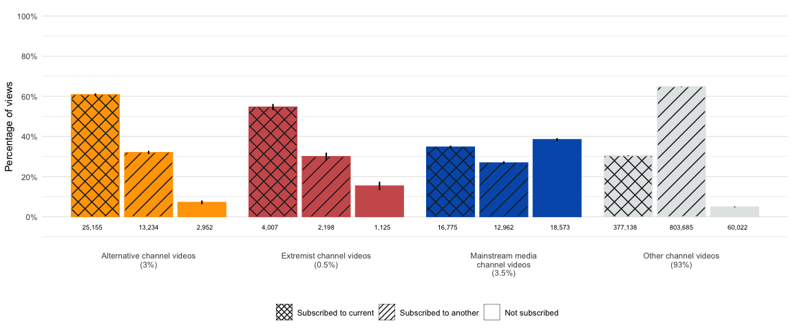
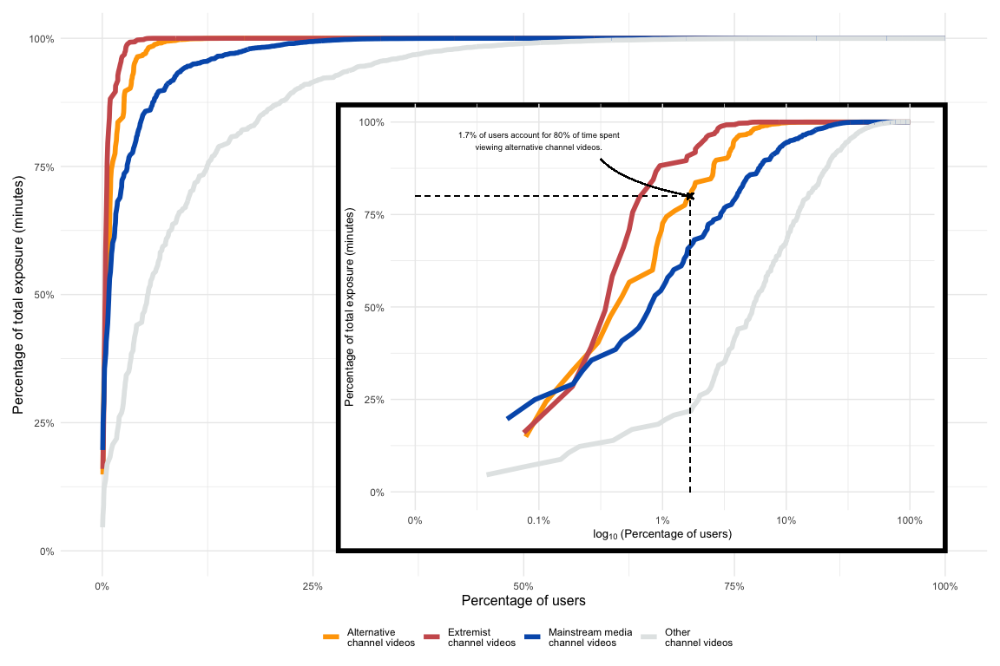
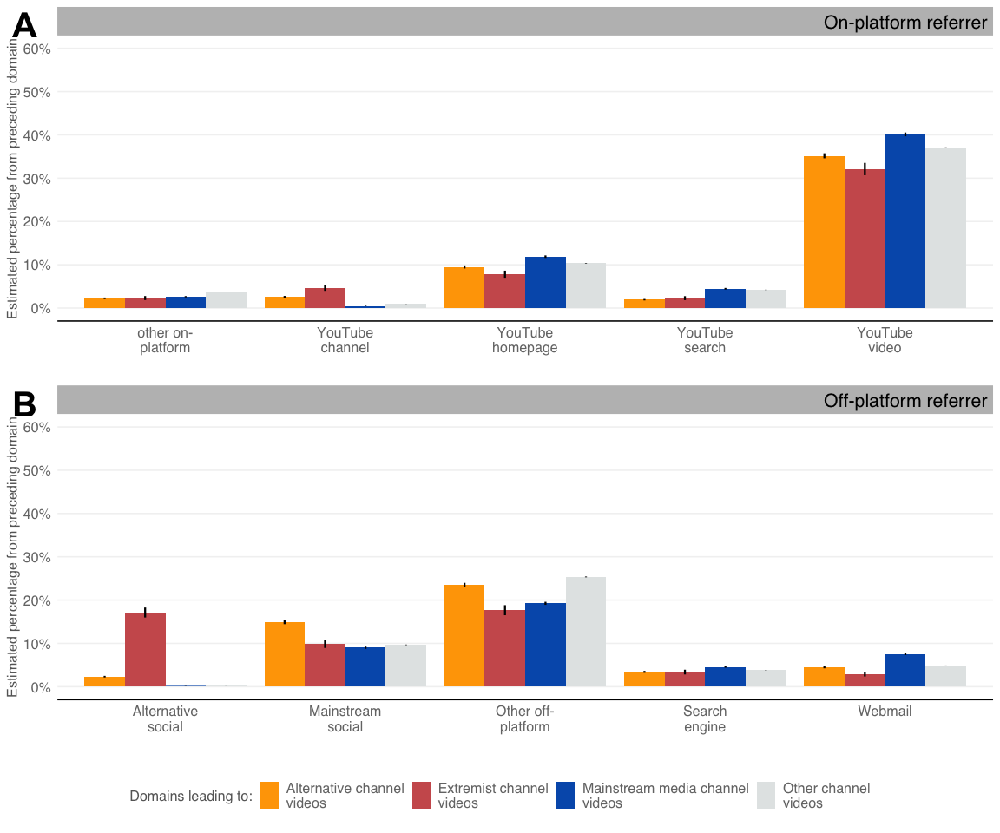

Figures in Main Text
================

``` r
# survey + extension data for individuals
merged_data <- read_rds("data/yg_browser_cces_merged.rds")

# activity data
activity_data <- read_rds("data/activity_yg_cces.rds") 

# subscriptions data (see build.R for construction of this table)
summarize_subscribe_table <-
  read_csv("data/summarize_subscribe_table.csv")

# referrers data (see build.R for construction of these tables)
on_platform_referrers_by_channel <- 
  read_csv('data/on_platform_referrers_by_channel.csv')
aggregated_referrers_by_channel <- 
  read_csv('data/aggregated_referrers_by_channel.csv')

# list of referrers (see appendix figs script for list of referrers)
referrers_list <- read_rds('data/referrers_list.rds')
external_referrers <- referrers_list$external_referrers
internal_referrers_other <- referrers_list$internal_referrers_other
internal_referrers <- referrers_list$internal_referrers

# recommendations data (see build.R for construction of this table)
recs_data <- 
  read_delim("data/recommendation_pipeline.tsv", delim = '\t')
```

``` r
source("helper_fxns.R") # these are mostly for plotting and presentation
```

``` r
# attach survey weights
svy_at <- svydesign(ids = ~ 1,
                    data = activity_data,
                    weights = ~ weight_cmd)

# color palette 
color_palette <- c("#FFA500", "#CD5C5C", "#015CB9", "#E3E6E6")

# all channel categoies
channel_types <- c("alternative",
                   "extremist",
                   "mainstream",
                   "other")

# dependent variables (time spent per week) by channel type
minutes_activity_time_all_week <- c(
    "minutes_activity_yt_video_time_elapsed_capped_total_alternative_all_week",
    "minutes_activity_yt_video_time_elapsed_capped_total_extremist_all_week",
    "minutes_activity_yt_video_time_elapsed_capped_total_mainstream_all_week",
    "minutes_activity_yt_video_time_elapsed_capped_total_other_all_week"
  )

# dummies for whether participant watch any of 
any_channel_type <- c("at_alt",
                      "at_ext",
                      "at_msm",
                      "at_other")

# whether participant watched any video that they subscribed to from X channel
any_subscribed_channel_type <- c(
  "at_any_alternative_subscribed",
  "at_any_extremist_subscribed",
  "at_any_mainstream_subscribed",
  "at_any_other_subscribed"
) 
```

``` r
weighted_mean_fxn <- function(x,
                              data) {
  svy_at <- svydesign(ids = ~ 1,
                      data = data,
                      weights = ~ weight_cmd)
  
  result <- svymean(~ get(x), design = svy_at, na.rm = T)
  
  median_result <-
    svyquantile(
      ~ get(x),
      quantiles = .5,
      design = svy_at,
      na.rm = T,
      ci = TRUE
    )[[1]][1]
  
  
  output <- tibble(
    channel_type = str_extract(x, paste0(channel_types, collapse = "|")),
    raw_mean = mean(pull(data, get(x)), na.rm = T),
    raw_se = sd(pull(data, get(x)), na.rm = T) / sqrt(nrow(na.omit(data[, x]))),
    weighted_mean = coef(result),
    weighted_median = median_result,
    weighted_se = SE(result)[1],
    lwr95 = weighted_mean - 1.96 * weighted_se,
    upr95 = weighted_mean + 1.96 * weighted_se
  ) %>%
    mutate(
      channel_type = case_when(
        channel_type == "alternative" ~ "Alternative",
        channel_type == "extremist" ~ "Extremist",
        channel_type == "mainstream" ~ "Mainstream",
        channel_type == "other" ~ "Other"
      )
    )
  
  return(output)
}

weighted_prop_fxn <- function(x, data) {
  
  weighted <- data %>%
    group_by(get(x)) %>%
    summarise(total = sum(weight_cmd)) %>%
    na.omit()
  
  result <- prop.table(weighted$total) * 100
  
  result_unweighted <- prop.table(table(data[x])) * 100
  
  output <- tibble(
    channel_type = str_extract(x, "alt|ext|msm|other"),
    raw_prop = result_unweighted[2],
    raw_se = sqrt((raw_prop * (100 - raw_prop)) / nrow(na.omit(data[, x]))),
    weighted_prop = result[2],
    weighted_se =  sqrt((weighted_prop * (
      100 - weighted_prop
    )) / nrow(na.omit(data[, x]))),
    lwr95 = weighted_prop - 1.96 * weighted_se,
    upr95 = weighted_prop + 1.96 * weighted_se
  ) %>%
    mutate(
      channel_type = case_when(
        channel_type == "alt" ~ "Alternative",
        channel_type == "ext" ~ "Extremist",
        channel_type == "msm" ~ "Mainstream",
        channel_type == "other" ~ "Other"
      )
    )
  return(output)
}
```

### Exposure level estimates (page 11)

Just 15% of the sample for whom we have browser activity data (n=1,181)
viewed any video from an alternative channel and only 6% viewed any
video from an extremist channel. By comparison, 44% viewed at least one
video from a mainstream media channel.

``` r
map_dfr(any_channel_type, ~ weighted_prop_fxn(.x, activity_data)) %>% 
  kbl(digits = 2, 
      format = "html") %>% 
  kable_styling()
```

<table class="table" style="margin-left: auto; margin-right: auto;">
<thead>
<tr>
<th style="text-align:left;">
channel_type
</th>
<th style="text-align:right;">
raw_prop
</th>
<th style="text-align:right;">
raw_se
</th>
<th style="text-align:right;">
weighted_prop
</th>
<th style="text-align:right;">
weighted_se
</th>
<th style="text-align:right;">
lwr95
</th>
<th style="text-align:right;">
upr95
</th>
</tr>
</thead>
<tbody>
<tr>
<td style="text-align:left;">
Alternative
</td>
<td style="text-align:right;">
14.06
</td>
<td style="text-align:right;">
1.01
</td>
<td style="text-align:right;">
15.43
</td>
<td style="text-align:right;">
1.05
</td>
<td style="text-align:right;">
13.37
</td>
<td style="text-align:right;">
17.49
</td>
</tr>
<tr>
<td style="text-align:left;">
Extremist
</td>
<td style="text-align:right;">
5.67
</td>
<td style="text-align:right;">
0.67
</td>
<td style="text-align:right;">
6.12
</td>
<td style="text-align:right;">
0.70
</td>
<td style="text-align:right;">
4.75
</td>
<td style="text-align:right;">
7.48
</td>
</tr>
<tr>
<td style="text-align:left;">
Mainstream
</td>
<td style="text-align:right;">
44.54
</td>
<td style="text-align:right;">
1.45
</td>
<td style="text-align:right;">
43.48
</td>
<td style="text-align:right;">
1.44
</td>
<td style="text-align:right;">
40.65
</td>
<td style="text-align:right;">
46.31
</td>
</tr>
<tr>
<td style="text-align:left;">
Other
</td>
<td style="text-align:right;">
88.48
</td>
<td style="text-align:right;">
0.93
</td>
<td style="text-align:right;">
88.75
</td>
<td style="text-align:right;">
0.92
</td>
<td style="text-align:right;">
86.95
</td>
<td style="text-align:right;">
90.55
</td>
</tr>
</tbody>
</table>

Among the set of people who saw at least one extremist channel video,
for instance, 52% saw at least one video from an extremist channel they
subscribe to during the study period. Similarly, 39% of all people who
saw at least one alternative channel video viewed at least one video
from a channel to which they subscribed.

``` r
# dfs with those who viewed any alternative/extremist/mainstream channel
viewed_any_channel_type <- list(
  activity_data %>% filter(at_alt == 1),
  activity_data %>% filter(at_ext == 1),
  activity_data %>% filter(at_msm == 1),
  activity_data %>% filter(at_other == 1)
)

map2_dfr(.x = any_subscribed_channel_type,
         .y = viewed_any_channel_type,
         ~ weighted_prop_fxn(.x, .y)) %>% 
  kbl(digits = 2, 
      format = "html") %>% 
  kable_styling()
```

<table class="table" style="margin-left: auto; margin-right: auto;">
<thead>
<tr>
<th style="text-align:left;">
channel_type
</th>
<th style="text-align:right;">
raw_prop
</th>
<th style="text-align:right;">
raw_se
</th>
<th style="text-align:right;">
weighted_prop
</th>
<th style="text-align:right;">
weighted_se
</th>
<th style="text-align:right;">
lwr95
</th>
<th style="text-align:right;">
upr95
</th>
</tr>
</thead>
<tbody>
<tr>
<td style="text-align:left;">
Alternative
</td>
<td style="text-align:right;">
39.16
</td>
<td style="text-align:right;">
3.79
</td>
<td style="text-align:right;">
38.99
</td>
<td style="text-align:right;">
3.79
</td>
<td style="text-align:right;">
31.57
</td>
<td style="text-align:right;">
46.41
</td>
</tr>
<tr>
<td style="text-align:left;">
Extremist
</td>
<td style="text-align:right;">
41.79
</td>
<td style="text-align:right;">
6.03
</td>
<td style="text-align:right;">
51.69
</td>
<td style="text-align:right;">
6.11
</td>
<td style="text-align:right;">
39.72
</td>
<td style="text-align:right;">
63.65
</td>
</tr>
<tr>
<td style="text-align:left;">
NA
</td>
<td style="text-align:right;">
20.34
</td>
<td style="text-align:right;">
1.76
</td>
<td style="text-align:right;">
20.26
</td>
<td style="text-align:right;">
1.75
</td>
<td style="text-align:right;">
16.82
</td>
<td style="text-align:right;">
23.69
</td>
</tr>
<tr>
<td style="text-align:left;">
Other
</td>
<td style="text-align:right;">
61.05
</td>
<td style="text-align:right;">
1.51
</td>
<td style="text-align:right;">
61.39
</td>
<td style="text-align:right;">
1.51
</td>
<td style="text-align:right;">
58.44
</td>
<td style="text-align:right;">
64.34
</td>
</tr>
</tbody>
</table>

## Figure 1: Distribution of video views by subscription status and channel type

``` r
summarize_subscribe_plot <- summarize_subscribe_table %>%
  mutate(subscribed_group = factor(
    subscribed_group,
    levels = c(
      "subscribed to current",
      "subscribed to another",
      "not subscribed"
    )
  ),
  channel_type = case_when(
    str_detect(channel_type, "Mainstream") ~ str_replace(channel_type, 'Mainstream media', 'Mainstream media\nchannel videos'),
    str_detect(channel_type, "Alternative") ~ str_replace(channel_type, 'Alternative channel', 'Alternative channel videos'),
    str_detect(channel_type, "Extremist") ~ str_replace(channel_type, 'Extremist channel', 'Extremist channel videos'),
    str_detect(channel_type, "Other") ~ str_replace(channel_type, 'Other channel', 'Other channel videos')
  )) %>%
  ggplot(aes(
    x = channel_type,
    y = percent,
    fill = channel_type,
    pattern = subscribed_group
  )) +
  geom_col_pattern(
    position = position_dodge2(.9),
    aes(color = channel_type),
    pattern_color = "#212426",
    pattern_fill = "#212426",
    pattern_angle = 45,
    pattern_density = 0.01,
    pattern_spacing = 0.04,
    pattern_key_scale_factor = 0.2
  ) +
  geom_text(aes(label = scales::comma(total_label), y = -5),
            position = position_dodge2(.95),
            size = 2.5) +
  geom_linerange(aes(ymin = ci_lwr95, ymax = ci_upr95),
                 position = position_dodge2(.9),
                 lwd = .75) +
  labs(x = "", y = "Percentage of views") +
  scale_y_continuous(
    limits = c(-10, 100),
    breaks = seq(0, 100, by = 20),
    labels = paste0(seq(0, 100, by = 20), "%")
  ) +
  scale_fill_manual(
    values = color_palette,
    name = "",
    labels = c(
      "Alternative channel",
      "Extremist channel",
      "Mainstream media channel",
      "Other channel"
    )
  ) +
  scale_color_manual(
    values = color_palette,
    name = "",
    labels = c(
      "Alternative channel",
      "Extremist channel",
      "Mainstream media channel",
      "Other channel"
    )
  ) +
  scale_pattern_manual(
    name = "",
    labels = c(
      "Subscribed to current",
      "Subscribed to another",
      "Not subscribed"
    ),
    values = c(
      "subscribed to current" = "crosshatch",
      "subscribed to another" = "stripe",
      "not subscribed" = "none"
    )
  ) +
  theme_minimal() +
  theme(
    strip.text = element_text(hjust = 0),
    panel.grid.major.x = element_blank(),
    panel.grid.minor.x = element_blank(),
    legend.position = 'bottom'
  ) +
  guides(
    fill = "none",
    pattern = guide_legend(override.aes = list(fill = "white", color = "black")),
    color = "none"
  )
summarize_subscribe_plot
```



``` r
ggsave('./main-text-figures_files/subscriptions_by_other_subscriptions.png',
       dpi = 600, width = 11, height = 6)
```

### Exposure level estimates (page 12)

Among the participants who viewed at least one video from an alternative
or extremist channel, the time spent watching them was relatively low:
26 minutes per week for alternative channel videos and 8 minutes for
extremist channel videos. The comparison statistics are 12 minutes per
week for mainstream media channel videos and 214 minutes per week for
videos from other channels

``` r
map2_dfr(.x = minutes_activity_time_all_week,
         .y = viewed_any_channel_type,
         ~ weighted_mean_fxn(.x, .y)) %>%
  kbl(format = "html",
      digits = 2) %>% 
  kable_styling()
```

<table class="table" style="margin-left: auto; margin-right: auto;">
<thead>
<tr>
<th style="text-align:left;">
channel_type
</th>
<th style="text-align:right;">
raw_mean
</th>
<th style="text-align:right;">
raw_se
</th>
<th style="text-align:right;">
weighted_mean
</th>
<th style="text-align:right;">
weighted_median
</th>
<th style="text-align:right;">
weighted_se
</th>
<th style="text-align:right;">
lwr95
</th>
<th style="text-align:right;">
upr95
</th>
</tr>
</thead>
<tbody>
<tr>
<td style="text-align:left;">
Alternative
</td>
<td style="text-align:right;">
27.31
</td>
<td style="text-align:right;">
6.38
</td>
<td style="text-align:right;">
25.72
</td>
<td style="text-align:right;">
1.09
</td>
<td style="text-align:right;">
6.16
</td>
<td style="text-align:right;">
13.65
</td>
<td style="text-align:right;">
37.78
</td>
</tr>
<tr>
<td style="text-align:left;">
Extremist
</td>
<td style="text-align:right;">
8.66
</td>
<td style="text-align:right;">
2.32
</td>
<td style="text-align:right;">
8.09
</td>
<td style="text-align:right;">
0.58
</td>
<td style="text-align:right;">
2.33
</td>
<td style="text-align:right;">
3.51
</td>
<td style="text-align:right;">
12.66
</td>
</tr>
<tr>
<td style="text-align:left;">
Mainstream
</td>
<td style="text-align:right;">
14.14
</td>
<td style="text-align:right;">
3.14
</td>
<td style="text-align:right;">
11.90
</td>
<td style="text-align:right;">
1.15
</td>
<td style="text-align:right;">
2.35
</td>
<td style="text-align:right;">
7.29
</td>
<td style="text-align:right;">
16.52
</td>
</tr>
<tr>
<td style="text-align:left;">
Other
</td>
<td style="text-align:right;">
185.76
</td>
<td style="text-align:right;">
15.77
</td>
<td style="text-align:right;">
214.22
</td>
<td style="text-align:right;">
20.36
</td>
<td style="text-align:right;">
22.97
</td>
<td style="text-align:right;">
169.21
</td>
<td style="text-align:right;">
259.24
</td>
</tr>
</tbody>
</table>

(62 minutes per week for subscribers to one or more alternative channels
\[6%\] versus 0.2 minutes per week for non-subscribers \[9%\]) and (15
minutes per week for subscribers \[3%\] versus 0.04 minute per week for
non-subscribers \[3%\]).

``` r
# dfs for those subsscribed to any X channel
subscribed_any_channel_type <- list(
  activity_data %>% filter(at_any_alternative_subscribed == 1),
  activity_data %>% filter(at_any_extremist_subscribed == 1),
  activity_data %>% filter(at_any_mainstream_subscribed == 1),
  activity_data %>% filter(at_any_other_subscribed == 1)
)

# dummy for NOT subsscribed to any X channel
notsubscribed_any_channel_type <- list(
  activity_data %>% filter(at_any_alternative_subscribed != 1),
  activity_data %>% filter(at_any_extremist_subscribed != 1),
  activity_data %>% filter(at_any_mainstream_subscribed != 1),
  activity_data %>% filter(at_any_other_subscribed != 1)
)

# calculate weighted mean for each channel type
subscriber_estimates <- map2_dfr(.x = minutes_activity_time_all_week,
                                 .y = subscribed_any_channel_type,
                                 ~ weighted_mean_fxn(.x, .y)) %>%
  mutate(subscription_status = paste0(channel_types,
                                      " sub"))

nonsubscriber_estimates <- map2_dfr(.x = minutes_activity_time_all_week,
                                    .y = notsubscribed_any_channel_type,
                                    ~ weighted_mean_fxn(.x, .y))  %>%
  mutate(subscription_status = paste0(channel_types,
                                      " non-sub"))

bind_rows(subscriber_estimates,
          nonsubscriber_estimates) %>% 
  kbl(format = "html",
      digits = 3) %>% 
  kable_styling()
```

<table class="table" style="margin-left: auto; margin-right: auto;">
<thead>
<tr>
<th style="text-align:left;">
channel_type
</th>
<th style="text-align:right;">
raw_mean
</th>
<th style="text-align:right;">
raw_se
</th>
<th style="text-align:right;">
weighted_mean
</th>
<th style="text-align:right;">
weighted_median
</th>
<th style="text-align:right;">
weighted_se
</th>
<th style="text-align:right;">
lwr95
</th>
<th style="text-align:right;">
upr95
</th>
<th style="text-align:left;">
subscription_status
</th>
</tr>
</thead>
<tbody>
<tr>
<td style="text-align:left;">
Alternative
</td>
<td style="text-align:right;">
64.106
</td>
<td style="text-align:right;">
15.088
</td>
<td style="text-align:right;">
62.224
</td>
<td style="text-align:right;">
23.959
</td>
<td style="text-align:right;">
14.823
</td>
<td style="text-align:right;">
33.171
</td>
<td style="text-align:right;">
91.277
</td>
<td style="text-align:left;">
alternative sub
</td>
</tr>
<tr>
<td style="text-align:left;">
Extremist
</td>
<td style="text-align:right;">
19.147
</td>
<td style="text-align:right;">
4.923
</td>
<td style="text-align:right;">
14.560
</td>
<td style="text-align:right;">
5.695
</td>
<td style="text-align:right;">
4.827
</td>
<td style="text-align:right;">
5.099
</td>
<td style="text-align:right;">
24.021
</td>
<td style="text-align:left;">
extremist sub
</td>
</tr>
<tr>
<td style="text-align:left;">
Mainstream
</td>
<td style="text-align:right;">
45.985
</td>
<td style="text-align:right;">
14.792
</td>
<td style="text-align:right;">
37.652
</td>
<td style="text-align:right;">
7.725
</td>
<td style="text-align:right;">
11.280
</td>
<td style="text-align:right;">
15.544
</td>
<td style="text-align:right;">
59.760
</td>
<td style="text-align:left;">
mainstream sub
</td>
</tr>
<tr>
<td style="text-align:left;">
Other
</td>
<td style="text-align:right;">
274.129
</td>
<td style="text-align:right;">
20.739
</td>
<td style="text-align:right;">
329.425
</td>
<td style="text-align:right;">
93.634
</td>
<td style="text-align:right;">
34.588
</td>
<td style="text-align:right;">
261.631
</td>
<td style="text-align:right;">
397.218
</td>
<td style="text-align:left;">
other sub
</td>
</tr>
<tr>
<td style="text-align:left;">
Alternative
</td>
<td style="text-align:right;">
0.328
</td>
<td style="text-align:right;">
0.135
</td>
<td style="text-align:right;">
0.239
</td>
<td style="text-align:right;">
0.000
</td>
<td style="text-align:right;">
0.078
</td>
<td style="text-align:right;">
0.086
</td>
<td style="text-align:right;">
0.392
</td>
<td style="text-align:left;">
alternative non-sub
</td>
</tr>
<tr>
<td style="text-align:left;">
Extremist
</td>
<td style="text-align:right;">
0.038
</td>
<td style="text-align:right;">
0.015
</td>
<td style="text-align:right;">
0.036
</td>
<td style="text-align:right;">
0.000
</td>
<td style="text-align:right;">
0.016
</td>
<td style="text-align:right;">
0.005
</td>
<td style="text-align:right;">
0.066
</td>
<td style="text-align:left;">
extremist non-sub
</td>
</tr>
<tr>
<td style="text-align:left;">
Mainstream
</td>
<td style="text-align:right;">
2.344
</td>
<td style="text-align:right;">
0.319
</td>
<td style="text-align:right;">
2.038
</td>
<td style="text-align:right;">
0.000
</td>
<td style="text-align:right;">
0.332
</td>
<td style="text-align:right;">
1.387
</td>
<td style="text-align:right;">
2.689
</td>
<td style="text-align:left;">
mainstream non-sub
</td>
</tr>
<tr>
<td style="text-align:left;">
Other
</td>
<td style="text-align:right;">
35.413
</td>
<td style="text-align:right;">
16.894
</td>
<td style="text-align:right;">
23.375
</td>
<td style="text-align:right;">
1.372
</td>
<td style="text-align:right;">
8.001
</td>
<td style="text-align:right;">
7.693
</td>
<td style="text-align:right;">
39.057
</td>
<td style="text-align:left;">
other non-sub
</td>
</tr>
</tbody>
</table>

## Figure 2. Concentration of exposure to alternative and extremist channels

``` r
#cumulative time spent on that channel and the cumulative user 
cumsum_fxn <- function (var, data) {
  channel_type <-
      str_replace(str_extract(var, "[a-z]+_all_week$"), "_all_week", "")
  data %>%
    arrange(desc(.data[[var]])) %>%
    mutate(
      users = weight_cmd / sum(.$weight_cmd, na.rm = T),
      views = (.data[[var]] / sum(.data[[var]], na.rm = T)),
      cum_user = cumsum(users),
      cum_views = cumsum(views),
      ln_cum_user = log10(cumsum(users)),
      ln_cum_views = log10(cumsum(views)),
      source = channel_type
    ) %>%
    select(cum_user, cum_views, ln_cum_user, source, caseid, weight_cmd)
}

# calculate for all channel types
concentration_time_user <- map_dfr(minutes_activity_time_all_week, 
                            ~cumsum_fxn(.x, activity_data))

# get the %user for 80% watch time
lab_stat <-
  cumsum_fxn('minutes_activity_yt_video_time_elapsed_capped_total_alternative_all_week',
             activity_data) %>%
  filter(round(cum_views, 2) == .8) %>%
  pull(ln_cum_user)

# log 10 on x-axis
time_cumsum_plot_inset <- concentration_time_user %>%
  ggplot(aes(x = ln_cum_user, y = cum_views, color = source)) +
  geom_line(size = 2) +
  geom_point(
    aes(x = lab_stat, y = .8),
    color = 'black',
    shape = 4,
    stroke = 1,
    size = 1.5
  ) +
  scale_y_continuous(labels = scales::percent) +
  scale_color_manual(
    name = "",
    labels = c(
      "Alternative\nchannel videos",
      "Extremist\nchannel videos",
      "Mainstream media\nchannel videos",
      "Other\nchannel videos"
    ),
    values = color_palette
  ) +
  geom_segment(aes(
    x = -4,
    xend = lab_stat,
    y = .8,
    yend = .8
  ),
  lty = 2,
  color = 'black') +
  geom_segment(aes(
    x = lab_stat,
    xend = lab_stat,
    y = 0,
    yend = .8
  ),
  lty = 2,
  color = 'black') +
  geom_curve(
    aes(
      x = -2.5,
      xend = lab_stat,
      y = .9,
      yend = .8
    ),
    curvature = 0.25,
    angle = 35,
    color = 'black'
  ) +
  scale_x_continuous(
    limits = c(-4, 0),
    breaks = seq(-4, 0,
                 by = 1),
    labels = paste0((round(10 ^ (
      seq(-4, 0,
          by = 1)
    ), 3)) * 100, "%")
  ) +
  annotate(
    "text",
    x = -3,
    y = .95,
    label = str_wrap(paste0(
      round(10^(lab_stat) * 100, 1),
      "% of users account for 80% of time \nspent viewing alternative channel videos."
    ), width = 45),
    size = 2.5
  ) +
  labs(x = expression(log[10]~ "(Percentage of users)"), 
       y = "Percentage of total exposure (minutes)") +
  theme_minimal() +
  theme(
    plot.background = element_blank(),
    legend.position = 'bottom',
    axis.title.x = element_text(size = 10),
    axis.title.y = element_text(size = 10)
  )

# without logging x
time_cumsum_plot_zoomout <- concentration_time_user %>%
  ggplot(aes(x = cum_user, y = cum_views, color = source)) +
  geom_line(size = 2) +
  scale_y_continuous(labels = scales::percent) +
  scale_x_continuous(labels = scales::percent) +
  scale_color_manual(
    name = "",
    labels = c(
      "Alternative\nchannel videos",
      "Extremist\nchannel videos",
      "Mainstream media\nchannel videos",
      "Other\nchannel videos"
    ),
    values = color_palette
  ) +
  annotate(geom = "rect", col = "black", fill = "white",
           lwd = 2,
           ymin = 0, ymax = .87, xmin = .28, xmax = 1) +
  labs(x = "Percentage of users", y = "Percentage of total exposure (minutes)") +
  theme_minimal() +
  theme(
    plot.background = element_blank(),
    legend.position = 'bottom',
    axis.title.x = element_text(size = 12),
    axis.title.y = element_text(size = 12)
  )

# combine inset (logged) and non-log 
time_cumsum_plot_zoomout +
  patchwork::inset_element(time_cumsum_plot_inset +
                             guides(color = "none"), 
                           left = 0.3, bottom = 0.05, right = .95, top = .85,
                           on_top = TRUE)
```



``` r
ggsave('./main-text-figures_files/cdf_users_time_exposure.png',
      dpi = 600, width = 8, height = 6)
```

### Exposure level estimates (page 13)

``` r
# join with rest of survey data
activity_data_supers <- activity_data %>%
  left_join(
    concentration_time_user %>%
      select(caseid, cum_views,  source) %>%
      pivot_wider(
        names_from = "source",
        names_glue = "cumsum_{source}",
        values_from = "cum_views"
      ),
    by = "caseid"
  ) %>%
  # define a superconsumer as someone who is in the top 80th percentile of watch time per week
  mutate(
    super_alternative = if_else(cumsum_alternative <= .8, 1, 0),
    super_extremist = if_else(cumsum_extremist <= .8, 1, 0),
    super_mainstream = if_else(cumsum_mainstream <= .8, 1, 0)
  )

# select the top alternative super consumers
top_time_all_weeks_most_alt <- activity_data_supers  %>%
  filter(super_alternative == 1)  %>%
  arrange(desc(
    minutes_activity_yt_video_time_elapsed_capped_total_alternative_all_week
  )) %>%
  mutate(rank = 1:nrow(.)) %>%
  pivot_longer(cols = all_of(minutes_activity_time_all_week)) %>%
  mutate(
    channel_type = str_replace(name, "_all_week$", ""),
    channel_type = str_extract(channel_type, "[a-z]+$"),
    minutes_value = value,
    image = if_else(
      super_extremist == 1 ,
      "https://i.postimg.cc/bwL3hjPY/user-icon-extremist.png",
      NA_character_
    )
  )

# select the top extremist super consumers
top_time_all_weeks_most_ext <- activity_data_supers  %>%
  filter(super_extremist == 1)  %>%
  arrange(desc(
    minutes_activity_yt_video_time_elapsed_capped_total_extremist_all_week
  )) %>%
  mutate(rank = 1:nrow(.)) %>%
  pivot_longer(cols = all_of(minutes_activity_time_all_week)) %>%
  mutate(
    channel_type = str_replace(name, "_all_week$", ""),
    channel_type = str_extract(channel_type, "[a-z]+$"),
    minutes_value = value,
    image = if_else(
      super_alternative == 1 ,
      "https://i.postimg.cc/D0BPKrVj/user-icon-alternative.png",
      NA_character_
    )
  )
```

1.6% of participants (17 people) account for 79% of total time spent on
videos from alternative channels.

``` r
concentration_time_user %>% 
  filter(source == "alternative" & cum_views <= .8) %>% 
  pull(cum_user) %>% 
  max()
```

    ## [1] 0.01561862

This imbalance is even more severe for extremist channels, where 0.6% of
participants (9 people) were responsible for 80% of total time spent on
these videos.

``` r
concentration_time_user %>% 
  filter(source == "extremist" & cum_views <= .8) %>% 
  pull(cum_user) %>% 
  max()
```

    ## [1] 0.006480922

### Exposure level estimates (Superconsumers in appendix)

Alternative channel superconsumers spend a weighted median of 29 hours
(1715 minutes) each week watching YouTube.

``` r
alternative_superconsumers <- activity_data_supers %>% 
  filter(super_alternative == 1) 

weighted_mean_fxn("minutes_at_yt_video_time_elapsed_capped_total_week",
                  data = alternative_superconsumers) %>% 
  pull(weighted_median) 
```

    ## [1] 1714.798

Extremist channel superconsumers spend a median of 16 hours (979
minutes) each week watching YouTube.

``` r
extemist_superconsumers <- activity_data_supers %>% 
  filter(super_extremist == 1) 

weighted_mean_fxn("minutes_at_yt_video_time_elapsed_capped_total_week",
                  data = extemist_superconsumers)  %>% 
  pull(weighted_median) 
```

    ## [1] 979.0627

Median time per week across all participants is 0.2 hours (14 minutes).

``` r
weighted_mean_fxn("minutes_at_yt_video_time_elapsed_capped_total_week",
                  data = activity_data_supers)  %>% 
  pull(weighted_median) 
```

    ## [1] 14.28387

Number of alternative superconsumers is 17.

``` r
activity_data_supers %>% 
  filter(super_alternative == 1) %>% 
  nrow()
```

    ## [1] 17

Number of extremist superconsumers is 9.

``` r
activity_data_supers %>% 
  filter(super_extremist == 1) %>% 
  nrow()
```

    ## [1] 9

## Figure 3. Predictors of watch time

``` r
# DV is time elapsed on channel video
f_time_alternative_all <- formula(minutes_activity_yt_video_time_elapsed_capped_total_alternative_all ~  rr_cts + jw_cts + fem_cts + age + gender + educ2 + race)
f_time_extremist_all <- formula(minutes_activity_yt_video_time_elapsed_capped_total_extremist_all ~  rr_cts + jw_cts + fem_cts + age + gender + educ2 + race )
f_time_mainstream_all <- formula(minutes_activity_yt_video_time_elapsed_capped_total_mainstream_all ~  rr_cts + jw_cts + fem_cts + age + gender + educ2 + race)

time_fs <- list(
  f_time_alternative_all,
  f_time_extremist_all,
  f_time_mainstream_all
)
```

``` r
# function to calculate rocust quasipoisson 
robust_weighted_quasipoisson <- function(data = activity_data,
                                         formula,
                                         robust_output = TRUE) {
  fit <- glm(
    formula,
    family = quasipoisson(link = "log"),
    offset = log(week),
    data = data,
    weights = weight_cmd
  )
  
  results <- fit
  
  if (robust_output == TRUE) {
    cov_mod <- vcovHC(fit, type = "HC0")
    std_err <- sqrt(diag(cov_mod))
    q_val <- qnorm(0.975) # stick to 95% CI
    
    results <- bind_cols(
      predictor = fit$coefficients %>% names(),
      estimate = coef(fit),
      robust_se = std_err,
      z = (coef(fit) / std_err),
      p_val = 1.96 * pnorm(abs(coef(fit) / std_err), lower.tail = FALSE),
      ci_lwr = coef(fit) - q_val  * std_err,
      ci_upr = coef(fit) + q_val  * std_err,
    ) %>%
      mutate(
        stat_sig = if_else(p_val < .05, "*", ""),
        channel_type = str_extract(
          as.character(formula)[2],
          "alternative|extremist|mainstream"
        )
      )
  }
  return(results)
}

QP_time_fit <- map(1:length(time_fs), 
                   ~robust_weighted_quasipoisson(formula = time_fs[[.x]]))

names(QP_time_fit) <-
  c("time_alternative_full",
    "time_extremist_full",
    "time_mainstream_full")

coef_names <- c("Intercept",
                "Racial resentment",
                "Feeling Jews",
                "Hostile sexism",
                "Age",
                "Male",
                "Some college",
                "Bachelor's degree",
                "Post-grad",
                "Non-white")
```

``` r
# need to take original model object without robust standard errors first, then separately estimate robust covariance matrix 
QP_time_fit_noSE <- map(time_fs,
                        ~robust_weighted_quasipoisson(formula = .x,
                                                      robust_output = FALSE))
names(QP_time_fit_noSE) <-
  c("time_alternative_full",
    "time_extremist_full",
    "time_mainstream_full")
```

##### dispersion

``` r
for (m in 1:length(time_fs)) {
  phi <- # calculate ratio between deviance residuals and residual degrees of freedom
    sum(residuals(QP_time_fit_noSE[[m]], type = "pearson") ^ 2) / QP_time_fit_noSE[[m]]$df.residual
  print(phi)
}
```

    ## [1] 704.1033
    ## [1] 166.6161
    ## [1] 1887.55

##### check multicollinearity

Compute Generalized VIFs (*V**I**F*<sup>(1/(2\**d**f*))</sup>) that
makes adjustment for categorical variables.

``` r
map(1:length(QP_time_fit_noSE),  ~car::vif(QP_time_fit_noSE[[.x]]))
```

    ## [[1]]
    ##             GVIF Df GVIF^(1/(2*Df))
    ## rr_cts  1.174241  1        1.083624
    ## jw_cts  1.167858  1        1.080675
    ## fem_cts 1.162951  1        1.078402
    ## age     1.162466  1        1.078177
    ## gender  1.139925  1        1.067673
    ## educ2   1.132206  3        1.020910
    ## race    1.126247  1        1.061248
    ## 
    ## [[2]]
    ##             GVIF Df GVIF^(1/(2*Df))
    ## rr_cts  1.174418  1        1.083706
    ## jw_cts  1.110369  1        1.053740
    ## fem_cts 1.167837  1        1.080665
    ## age     1.092220  1        1.045093
    ## gender  1.146128  1        1.070573
    ## educ2   1.139993  3        1.022077
    ## race    1.058478  1        1.028824
    ## 
    ## [[3]]
    ##             GVIF Df GVIF^(1/(2*Df))
    ## rr_cts  2.547149  1        1.595979
    ## jw_cts  1.151366  1        1.073017
    ## fem_cts 2.492415  1        1.578739
    ## age     1.183410  1        1.087847
    ## gender  1.043968  1        1.021748
    ## educ2   1.150288  3        1.023610
    ## race    1.092030  1        1.045002

``` r
time_models <- bind_rows(QP_time_fit)

time_models %>%
  filter(predictor != "(Intercept)") %>%
  mutate(predictor = refactor_fxn(recode_fxn(predictor))) %>%
  ggplot(aes(x = estimate, y = str_wrap_factor(predictor, width = 12))) +
  geom_vline(xintercept = 0, lty = 2) +
  geom_linerange(
    aes(xmin = ci_lwr, xmax = ci_upr,
        color = channel_type),
    size = 9,
    show.legend = FALSE
  ) +
  geom_point(
    size = 10,
    shape = 21,
    stroke = 1,
    color = "black",
    fill = "#FFFFFF"
  ) +
  geom_text(aes(label = format(round(estimate, 2), nsmall = 2)),
            size = 3.5, color = "black") +
  geom_text(
    aes(label = stat_sig),
    size = 8,
    nudge_x = .45,
    nudge_y = .25
  ) +
  facet_wrap(~ channel_type,
             labeller = as_labeller(
               c(
                 "alternative" = str_wrap("Minutes/week on alternative channel videos", width = 30),
                 "extremist" = str_wrap("Minutes/week on extremist channel videos", width = 30),
                 "mainstream" = str_wrap("Minutes/week on mainstream media channel videos", width = 30)
               )
             )) +
  scale_color_manual(values = c(
    "alternative" = "#FFA500",
    "extremist" = "#CD5C5C",
    "mainstream" = "#015CB9"
  )) +
  labs(y = "", x = "Quasipoisson coefficient") +
  theme_bw() +
  theme(
    strip.text = element_text(size = 12, hjust = .5),
    strip.background = element_rect(fill = "grey", color = "grey"),
    axis.text.y = element_text(size = 12)
  )
```


``` r
ggsave('./main-text-figures_files/qpois_coefficient_time.png',
      dpi = 600, width = 12, height = 6)
```

## Figure 4. Hostile sexism as predictor of alternative and extremist channel viewing

``` r
vars <- c("rr_tercile", "ft_jew_binned", "gender", "educ2", "race", "pid_lean")
modes <- map(vars, function (i) mode_fxn(i))
names(modes) <- vars

get_predictions <- function (model_name,
                             data,
                             model) {
  # new data fixing all other covariates, varying hostile sexism
  new_data <- 
    expand.grid(
          rr_cts = median(activity_data$rr_cts, na.rm = T),
          jw_cts = median(activity_data$jw_cts, na.rm = T),
          fem_cts = seq(
            min(data$fem_cts, na.rm = T),
            max(data$fem_cts, na.rm = T),
            by = .25
          ),
          week = median(activity_data$week, na.rm = T),
          age = median(activity_data$age, na.rm = T),
          gender = modes$gender,
          educ2 = modes$educ2,
          race = modes$race
    )
  # new data matrix with dummies for categorical variables
  mod_mat <-
    expand.grid(
      intercept = 1,
      rr_cts = median(activity_data$rr_cts, na.rm = T),
      jw_cts = median(activity_data$jw_cts, na.rm = T),
      fem_cts = seq(
        min(activity_data$fem_cts, na.rm = T),
        max(activity_data$fem_cts, na.rm = T),
        by = .25
      ),
      age = median(activity_data$age, na.rm = T),
      genderMale = 1.00000,
      `educ2Some college` = 1.00000,
      `educ24-year` = 0,
      `educ2Post-grad` = 0,
      `raceNon-white` = 0
    )
  # make prediction for each level of hostile sexism and constant other covariate values
  preds <-  predict(model[[model_name]],
                    newdata = new_data,
                    type = "link")
  
  link_inverse <- family(model[[model_name]])$linkinv
  
  crit_val95 <-
    qt(0.025, df = df.residual(model[[model_name]]), lower.tail = FALSE)
  
  # get robust covariance matrix
    var_cov_matrix <-
      vcovHC(model[[model_name]], type = "HC0")
    
  # for each level of hostile sexism and constant other covariates, 
  # calculate with robust covariance matrix
  slices <- map(1:nrow(mod_mat), ~ t(mod_mat[.x, ]))
  robust_se_link <-
    sapply(slices, function (x) {
      sqrt(t(x) %*% var_cov_matrix %*% x)
    })
  
  predicted_df <-
    bind_cols(mod_mat,
              tibble(fit_link = preds,
                     robuse_se_link = robust_se_link)) %>%
    mutate(
      fit_response  = link_inverse(fit_link),
      ci_upr95 = link_inverse(fit_link + (crit_val95 * robuse_se_link)),
      ci_lwr95 = link_inverse(fit_link - (crit_val95 * robuse_se_link)),
      mod = model_name,
      response_var = all.vars(formula(model[[model_name]]))[1],
      alt_ext = str_extract(model_name, "^[a-z]+")
    )
  return(predicted_df)
}
```

``` r
predicted_data_alternative <- get_predictions(
  model_name = "time_alternative_full",
  data = activity_data,
  model = QP_time_fit_noSE
) %>%
  mutate(channel_type = "alternative")

predicted_data_extremist <- get_predictions(
  model_name = "time_extremist_full",
  data = activity_data,
  model = QP_time_fit_noSE
) %>%
  mutate(channel_type = "extremist")

# join alternative and extremist data
predicted_data <-
  bind_rows(predicted_data_alternative, 
            predicted_data_extremist)

# set y-axis limits
predicted_data <- data.table(predicted_data)
predicted_data[channel_type == "alternative", y_min := 0]
predicted_data[channel_type == "alternative", y_max := 2000]
predicted_data[channel_type == "extremist", y_min := 0]
predicted_data[channel_type == "extremist", y_max := 500]


ggplot(predicted_data, aes(x = fem_cts, y = fit_response)) +
  geom_rug(
    data = activity_data %>%
      filter(!is.na(.data[['fem_cts']])),
    aes(x = .data[['fem_cts']], y = 0),
    color = "darkgrey",
    alpha = .4,
    sides = "b",
    position = position_jitter(width = .2),
    inherit.aes = F
  ) +
  geom_ribbon(aes(fill = channel_type,
                  ymin = ci_lwr95 ,
                  ymax = ci_upr95),
              #show.legend = FALSE,
              alpha = .95) +
  geom_line(size = 2) +
  facet_wrap( ~ channel_type,
              labeller = as_labeller(c(
                "alternative" = str_wrap("Alternative channel videos",
                                         width = 30),
                "extremist" = str_wrap("Extremist channel videos",
                                       width = 30)
              )),
              scales = "free_y") +
  geom_blank(aes(y = y_min)) +
  geom_blank(aes(y = y_max)) +
  scale_fill_manual(
    values = c("#FFA500", "#CD5C5C"),
    name = "",
    labels = c(
      "Alternative channel videos \ny-axis = [0, 2000]",
      "Extremist channel videos \ny-axis = [0, 500]"
    )
  ) +
  labs(x = "Hostile sexism scale",
       y = "Expected minutes per week on channel videos") +
  theme_minimal() +
  theme(
    plot.title = element_text(size = 12),
    legend.position = "bottom",
    strip.text = element_blank(),
    strip.background = element_blank()
  )
```


``` r
ggsave('./main-text-figures_files/hostile_sexism_predicted.png',
      dpi = 600, width = 12, height = 6)
```

### Correlates of exposure (pages 15–16)

When hostile sexism is at its minimum value of 1, expected levels are
0.4 minutes per week spent watching alternative channel videos and 0.08
minutes for extremist channel videos. These predicted values increase to
383 and 51 minutes, respectively, when hostile sexism is at its maximum
value of 5 (with the greatest marginal increases as hostile sexism
reaches its highest levels).

``` r
predicted_data_alternative %>% 
  filter(fem_cts %in% c(min(fem_cts), max(fem_cts)) ) %>% 
  select(fem_cts, fit_response) %>% 
  rename(`Hostile sexism score` = fem_cts,
         `Predicted value` = fit_response) %>% 
  kbl(digits = 2, 
      format = "html") %>% 
  kable_styling()
```

<table class="table" style="margin-left: auto; margin-right: auto;">
<thead>
<tr>
<th style="text-align:right;">
Hostile sexism score
</th>
<th style="text-align:right;">
Predicted value
</th>
</tr>
</thead>
<tbody>
<tr>
<td style="text-align:right;">
1
</td>
<td style="text-align:right;">
0.41
</td>
</tr>
<tr>
<td style="text-align:right;">
5
</td>
<td style="text-align:right;">
383.01
</td>
</tr>
</tbody>
</table>

``` r
predicted_data_extremist %>% 
  filter(fem_cts %in% c(min(fem_cts), max(fem_cts)) ) %>% 
  select(fem_cts, fit_response)%>% 
  rename(`Hostile sexism score` = fem_cts,
         `Predicted value` = fit_response) %>% 
  kbl(digits = 2, 
      format = "html") %>% 
  kable_styling()
```

<table class="table" style="margin-left: auto; margin-right: auto;">
<thead>
<tr>
<th style="text-align:right;">
Hostile sexism score
</th>
<th style="text-align:right;">
Predicted value
</th>
</tr>
</thead>
<tbody>
<tr>
<td style="text-align:right;">
1
</td>
<td style="text-align:right;">
0.08
</td>
</tr>
<tr>
<td style="text-align:right;">
5
</td>
<td style="text-align:right;">
51.00
</td>
</tr>
</tbody>
</table>

### Internal and external referrers (page 20)

49% and 51% of referrers to alternative and extremist channel videos,
respectively, were off-platform sources compared to 41% and 44%,
respectively, for videos from mainstream media channels and other
channels.

``` r
on_platform_referrers_by_channel %>% 
  filter(youtube_video_referrers_by_channel_type == "Off-platform") %>% 
  select(channel_type, youtube_video_referrers_by_channel_type, percentage)%>% 
  kbl(digits = 2, 
      format = "html") %>% 
  kable_styling()
```

<table class="table" style="margin-left: auto; margin-right: auto;">
<thead>
<tr>
<th style="text-align:left;">
channel_type
</th>
<th style="text-align:left;">
youtube_video_referrers_by_channel_type
</th>
<th style="text-align:right;">
percentage
</th>
</tr>
</thead>
<tbody>
<tr>
<td style="text-align:left;">
alternative
</td>
<td style="text-align:left;">
Off-platform
</td>
<td style="text-align:right;">
48.58
</td>
</tr>
<tr>
<td style="text-align:left;">
extremist
</td>
<td style="text-align:left;">
Off-platform
</td>
<td style="text-align:right;">
50.89
</td>
</tr>
<tr>
<td style="text-align:left;">
mainstream
</td>
<td style="text-align:left;">
Off-platform
</td>
<td style="text-align:right;">
40.46
</td>
</tr>
<tr>
<td style="text-align:left;">
other
</td>
<td style="text-align:left;">
Off-platform
</td>
<td style="text-align:right;">
43.86
</td>
</tr>
</tbody>
</table>

…we observe homophily across the video types, with 18% of referrers to
alternative videos coming from other alternative video, 14% of referrers
to extreme videos coming from other extreme videos, and 26% of referrers
to mainstream media videos coming from other mainstream media videos

``` r
on_platform_referrers_by_channel %>% 
  filter(youtube_video_referrers_by_channel_type == channel_type) %>% 
  select(channel_type, youtube_video_referrers_by_channel_type, percentage)%>% 
  kbl(digits = 2, 
      format = "html") %>% 
  kable_styling()
```

<table class="table" style="margin-left: auto; margin-right: auto;">
<thead>
<tr>
<th style="text-align:left;">
channel_type
</th>
<th style="text-align:left;">
youtube_video_referrers_by_channel_type
</th>
<th style="text-align:right;">
percentage
</th>
</tr>
</thead>
<tbody>
<tr>
<td style="text-align:left;">
alternative
</td>
<td style="text-align:left;">
alternative
</td>
<td style="text-align:right;">
18.30
</td>
</tr>
<tr>
<td style="text-align:left;">
extremist
</td>
<td style="text-align:left;">
extremist
</td>
<td style="text-align:right;">
13.90
</td>
</tr>
<tr>
<td style="text-align:left;">
mainstream
</td>
<td style="text-align:left;">
mainstream
</td>
<td style="text-align:right;">
25.88
</td>
</tr>
<tr>
<td style="text-align:left;">
other
</td>
<td style="text-align:left;">
other
</td>
<td style="text-align:right;">
35.93
</td>
</tr>
</tbody>
</table>

Interestingly, we observe 5% of referrals to extreme videos coming from
alternative videos, but only 0.7% of referrals from alternative videos
coming from extreme videos

``` r
on_platform_referrers_by_channel %>% 
  filter(youtube_video_referrers_by_channel_type %in% c("alternative", "extremist") &
           channel_type %in% c("alternative", "extremist")) %>% 
  select(channel_type, youtube_video_referrers_by_channel_type, percentage)%>% 
  kbl(digits = 2, 
      format = "html") %>% 
  kable_styling()
```

<table class="table" style="margin-left: auto; margin-right: auto;">
<thead>
<tr>
<th style="text-align:left;">
channel_type
</th>
<th style="text-align:left;">
youtube_video_referrers_by_channel_type
</th>
<th style="text-align:right;">
percentage
</th>
</tr>
</thead>
<tbody>
<tr>
<td style="text-align:left;">
alternative
</td>
<td style="text-align:left;">
alternative
</td>
<td style="text-align:right;">
18.30
</td>
</tr>
<tr>
<td style="text-align:left;">
alternative
</td>
<td style="text-align:left;">
extremist
</td>
<td style="text-align:right;">
0.72
</td>
</tr>
<tr>
<td style="text-align:left;">
extremist
</td>
<td style="text-align:left;">
alternative
</td>
<td style="text-align:right;">
5.05
</td>
</tr>
<tr>
<td style="text-align:left;">
extremist
</td>
<td style="text-align:left;">
extremist
</td>
<td style="text-align:right;">
13.90
</td>
</tr>
</tbody>
</table>

Lastly, we observe that alternative, extreme, and mainstream media
videos all receive roughly equal referrals from videos in other channels
(13–16%) and other on-platform sources (16–19%).

``` r
on_platform_referrers_by_channel %>% 
  filter(youtube_video_referrers_by_channel_type%in% c("other", "Non-video on-platform")&
           channel_type %in% c("alternative", "extremist", "mainstream") ) %>% 
  select(channel_type, youtube_video_referrers_by_channel_type, percentage)%>% 
  kbl(digits = 2, 
      format = "html") %>% 
  kable_styling()
```

<table class="table" style="margin-left: auto; margin-right: auto;">
<thead>
<tr>
<th style="text-align:left;">
channel_type
</th>
<th style="text-align:left;">
youtube_video_referrers_by_channel_type
</th>
<th style="text-align:right;">
percentage
</th>
</tr>
</thead>
<tbody>
<tr>
<td style="text-align:left;">
alternative
</td>
<td style="text-align:left;">
other
</td>
<td style="text-align:right;">
15.56
</td>
</tr>
<tr>
<td style="text-align:left;">
alternative
</td>
<td style="text-align:left;">
Non-video on-platform
</td>
<td style="text-align:right;">
16.24
</td>
</tr>
<tr>
<td style="text-align:left;">
extremist
</td>
<td style="text-align:left;">
other
</td>
<td style="text-align:right;">
12.72
</td>
</tr>
<tr>
<td style="text-align:left;">
extremist
</td>
<td style="text-align:left;">
Non-video on-platform
</td>
<td style="text-align:right;">
17.01
</td>
</tr>
<tr>
<td style="text-align:left;">
mainstream
</td>
<td style="text-align:left;">
other
</td>
<td style="text-align:right;">
13.66
</td>
</tr>
<tr>
<td style="text-align:left;">
mainstream
</td>
<td style="text-align:left;">
Non-video on-platform
</td>
<td style="text-align:right;">
19.42
</td>
</tr>
</tbody>
</table>

Bootstrap difference between alternative/extremist off-platform
referrers (49% and 51%) vs. other off-platform referrers (44%) (page
16). 95% bootstrapped CIs are in square parentheses.

(CODE ONLY, see how `youtube_referrers_data` is constructed in
`build.R`)

-   alternative v. other: 0.0472 \[0.0408, 0.0539\]
-   extremist v. other: 0.0702 \[0.0550, 0.0865\]
-   alternative v. mainstream: 0.0812 \[0.0738 , 0.0888\]
-   extremist v. mainstream: 0.1043 \[0.0873 , 0.1196\]

``` r
alt_ext_oth <- youtube_referrers_data %>%
  select(channel_type, youtube_video_referrers_by_channel_type)

n_bs_samples <- 1000
gen_bootstrp_samples <- function(channel_type1, channel_type2) {
  ind <- sample(1:nrow(alt_ext_oth), replace = TRUE)
  d <- alt_ext_oth[ind,]
  ct1 <- d[d$channel_type ==channel_type1,]
  ct2 <- d[d$channel_type ==channel_type2,]
  p_ct1 <- prop.table(table(ct1$youtube_video_referrers_by_channel_type))['Off-platform']
  p_ct2 <- prop.table(table(ct2$youtube_video_referrers_by_channel_type))['Off-platform']
  d_p <- p_ct1 - p_ct2
  #print(d_p)
  return(d_p)
}
set.seed(20202021)
alt_other_bs_samples <- replicate(
  n = n_bs_samples,
  expr = gen_bootstrp_samples(channel_type1 = 'alternative',
                              channel_type2 = 'other')
)
ext_other_bs_samples <- replicate(
  n = n_bs_samples,
  expr = gen_bootstrp_samples(channel_type1 = 'extremist',
                              channel_type2 = 'other')
  )
alt_msm_bs_samples <- replicate(
  n = n_bs_samples,
  expr = gen_bootstrp_samples(channel_type1 = 'alternative',
                              channel_type2 = 'mainstream')
)
ext_msm_bs_samples <- replicate(
  n = n_bs_samples,
  expr = gen_bootstrp_samples(channel_type1 = 'extremist',
                              channel_type2 = 'mainstream')
)
bs_CIs <- map(
  list(alt_other_bs_samples, 
       ext_other_bs_samples, 
       alt_msm_bs_samples, 
       ext_msm_bs_samples),
  ~quantile(.x, c(0.025,0.975))
)
```

## Figure 5: Recommendation frequency by type of channel being watched

``` r
### ===== recommendations shown setup
# recs_prop_table_fxn() is in helper_fxns.R
#inputs to waffle_plot_fxn
alternative_shown_table <-
  recs_prop_table_fxn(channel_type = "alternative",
                      statistic = "shown")
extremist_shown_table <-
  recs_prop_table_fxn(channel_type = "extremist",
                      statistic = "shown")
mainstream_shown_table <-
  recs_prop_table_fxn(channel_type = "mainstream",
                      statistic = "shown")
other_shown_table <- recs_prop_table_fxn(channel_type = "other",
                                         statistic = "shown")
#outputs to waffle_plot_fxn
alternative_recs_shown <-
  waffle_plot_fxn(alternative_shown_table,
                  statistic = "shown",
                  title = "Alternative channel\nvideos")
extremist_recs_shown <-
  waffle_plot_fxn(extremist_shown_table,
                  statistic = "shown",
                  title = "Extremist channel\nvideos")
mainstream_recs_shown <-
  waffle_plot_fxn(mainstream_shown_table,
                  statistic = "shown",
                  title = "Mainstream media\nchannel videos")
other_recs_shown <-
  waffle_plot_fxn(other_shown_table, statistic = "shown",
                  title = "Other channel\nvideos")

# bar on top of waffles to show scale
total_recs_shown_table <- recs_data %>%
  filter(variable == "total recs shown") %>%
  pivot_longer(-variable) %>%
  select(-variable) %>%
  mutate(
    overall_percent = 100 * (value / sum(value)),
    cumulative_percent = cumsum(overall_percent)
  )

bar_recs_shown_plot <- scale_plot_fxn(data = total_recs_shown_table,
                                      segment_y_upper = 10,
                                      statistic = "shown")

# dummy plot for legend
dummy_plot_shown <- alternative_shown_table %>%
  ggplot(aes(fill = factor(shown),
             values = prop * 100))  +
  geom_waffle(
    n_rows = 10,
    size = .5,
    color = "white",
    make_proportional = TRUE,
    radius = unit(5, "pt")
  ) +
  scale_fill_manual(
    values = c(
      'alternative' = "#FFA500",
      'extremist' = "#CD5C5C",
      'mainstream' = "#015CB9",
      'other' = '#E3E6E6'
    ),
    labels = c(
      'Alternative channel\nvideos' ,
      'Extremist channel\nvideos',
      'Mainstream media\nchannel videos',
      'Other channel\nvideos'
    ),
    name = "Recommendations shown to:"
  ) +
  theme(
    plot.title = ggtext::element_markdown(size = 12, hjust = .5),
    legend.position = 'bottom'
    
  )

# same legend
common_legend_shown <- lemon::g_legend(dummy_plot_shown)

# put waffles together
all_waffles_shown <- gridExtra::arrangeGrob(
  alternative_recs_shown,
  extremist_recs_shown,
  mainstream_recs_shown,
  other_recs_shown,
  nrow = 1
) 
```

``` r
# add legend and bar to waffles
recs_shown_grid <- plot_grid(
  plot_grid(
    bar_recs_shown_plot,
    all_waffles_shown,
    rel_heights = c(1.2, 1.5),
    labels = c(
      "A) Percentage of total recommendations shown:",
      "B) Recommendations shown when watching:"
    ),
    label_y = c(.9, 1.1),
    label_size = 18,
    hjust = 0,
    nrow = 2
  ),
  common_legend_shown,
  ncol = 1,
  rel_heights = c(1, .1)
)
recs_shown_grid
```


``` r
ggsave('./main-text-figures_files/waffle_recs_shown.png',
      dpi = 600, width = 14, height = 8)
```

## Figure 6: YouTube recommendations by subscription status and channel type

``` r
# select all subscription variables
sub_data <- activity_data %>% 
  select(ends_with("subscribed"),
         ends_with("unclassified"),
         -contains("adl"),
         caseid, weight_cmd) %>%
  # make names consistent
  rename(activity_yt_n_video_total_subscribed = activity_yt_n_video_subscribed,
         activity_yt_n_video_total_notsubscribed = activity_yt_n_video_notsubscribed,
         activity_yt_n_video_total_unclassified = activity_yt_n_video_unclassified,
         activity_yt_rec_n_video_total_subscribed = activity_yt_rec_n_total_subscribed,
         activity_yt_rec_n_video_total_notsubscribed = activity_yt_rec_n_total_notsubscribed,
         activity_yt_rec_n_video_total_unclassified = activity_yt_rec_n_total_unclassified,
         activity_yt_rec_match_n_video_total_subscribed = activity_yt_rec_match_n_video_subscribed,
         activity_yt_rec_match_n_video_total_notsubscribed = activity_yt_rec_match_n_video_notsubscribed,
         activity_yt_rec_match_n_video_total_unclassified = activity_yt_rec_match_n_video_unclassified) 


n_video_substatus <- 
  sub_data %>% 
    select(starts_with('activity_yt_n_video')) %>% 
    summarise_all(~sum(.x, na.rm = T)) %>% 
    pivot_longer(everything()) %>% 
    separate(col = name,
             sep = "(?:_[^_]+){3}",
             into = c("metric", "channel_type"),
             remove = TRUE) %>% 
    mutate(metric = 'activity_yt_n_video',
           channel_type = str_extract(channel_type, "[^_]\\w+_\\w+"))%>% 
    separate(col = channel_type,
             sep = "_",
             into = c("channel_type", "status"),
             remove = FALSE) %>% 
    pivot_wider(names_from = status, 
                values_from = value) %>% 
    mutate(total = subscribed + notsubscribed + unclassified) %>% 
    mutate(across(c(subscribed, notsubscribed, unclassified), 
                  .fns = function(.x) (.x/total))) %>% 
    select(metric, channel_type, subscribed, everything()) 

# recommendations shown
rec_n_video_substatus <- 
  sub_data %>% 
  select(starts_with('activity_yt_rec_n_video')) %>% 
  summarise_all(~sum(.x, na.rm = T)) %>% 
  pivot_longer(everything()) %>% 
  separate(col = name,
           sep = "(?:_[^_]+){4}",
           into = c("metric", "channel_type"),
           remove = TRUE) %>% 
  mutate(metric = 'activity_yt_rec_n_video',
         channel_type = str_extract(channel_type, "[^_]\\w+_\\w+"))%>% 
  separate(col = channel_type,
           sep = "_",
           into = c("channel_type", "status"),
           remove = FALSE) %>% 
  pivot_wider(names_from = status, 
              values_from = value) %>% 
  mutate(total = subscribed + notsubscribed + unclassified) %>% 
  mutate(across(c(subscribed, notsubscribed, unclassified), 
                .fns = function(.x) (.x/total))) %>% 
  select(metric, channel_type, subscribed, everything()) 

# recommendations followed 
rec_match_n_video_substatus <- 
  sub_data %>% 
  select(starts_with('activity_yt_rec_match_n_video')) %>% 
  summarise_all(~sum(.x, na.rm = T)) %>% 
  pivot_longer(everything()) %>% 
  separate(col = name,
           sep = "(?:_[^_]+){5}",
           into = c("metric", "channel_type"),
           remove = TRUE) %>% 
  mutate(metric = 'activity_yt_rec_match_n_video',
         channel_type = str_extract(channel_type, "[^_]\\w+_\\w+"))%>% 
  separate(col = channel_type,
           sep = "_",
           into = c("channel_type", "status"),
           remove = FALSE) %>% 
  pivot_wider(names_from = status, 
              values_from = value) %>% 
  mutate(total = subscribed + notsubscribed + unclassified) %>% 
  mutate(across(c(subscribed, notsubscribed, unclassified), 
                .fns = function(.x) (.x/total))) %>% 
  select(metric, channel_type, subscribed, everything()) 


combined <-
  rec_n_video_substatus %>%
  pivot_longer(
    cols = c(subscribed, notsubscribed, unclassified),
    names_to = "status",
    values_to = "prop"
  ) %>%
  mutate(
    stderr = sqrt((prop * (1 - prop)) / total),
    ci_lwr95 = prop - qt(.025, df = total, lower.tail = F) *
      stderr,
    ci_upr95 = prop + qt(.025, df = total, lower.tail = F) *
      stderr
  ) %>%
  bind_rows(
    rec_match_n_video_substatus %>%
      pivot_longer(
        cols = c(subscribed, notsubscribed, unclassified),
        names_to = "status",
        values_to = "prop"
      ) %>%
      mutate(
        stderr = sqrt((prop * (1 - prop)) / total),
        ci_lwr95 = prop - qt(.025, df = total, lower.tail = F) *
          stderr,
        ci_upr95 = prop + qt(.025, df = total, lower.tail = F) *
          stderr
      )
  ) %>%
  filter(status == "subscribed" & channel_type != "total") %>%
  mutate(
    metric = factor(
      ifelse(
        metric == "activity_yt_rec_n_video",
        "Recommendations shown",
        "Recommendations followed"
      ),
      levels = c("Recommendations shown",
                 "Recommendations followed")
    ),
    channel_type_label = case_when(
      channel_type == "alternative" ~ "Alternative channel videos\n(2.7%)",
      channel_type == "extremist" ~ "Extremist channel videos\n(0.4%)",
      channel_type == "mainstream" ~ "Mainstream media channel videos\n(4.6%)",
      channel_type == "other" ~ "Other channel videos\n(92.3%)"
    ),
    total_label = scales::comma(total)
  ) %>%
  group_by(channel_type) %>%
  mutate(channel_type_sum = sum(total))


# only subscribed bars
combined %>%
  ggplot(aes(x = channel_type_label, 
             y = prop*100,
             fill = channel_type_label,
             pattern = metric)) +
  geom_col_pattern(position = position_dodge2(.9),
                   aes(color = channel_type_label),
                   pattern_color = "#212426",
                   pattern_fill = "#212426",
                   pattern_angle = 45,
                   #pattern_density = 0.06,
                   pattern_spacing = 0.05,
                   pattern_key_scale_factor = 0.2) +
  geom_text(aes(label = total_label, y = -5),
            position = position_dodge2(.9),
            size = 2.5) +
  geom_linerange(aes(ymin = ci_lwr95*100, ymax = ci_upr95*100),
                 position = position_dodge2(.9),
                 lwd = .8) +
  labs(x = "", y = "Percent subscribed to channel") +
  scale_y_continuous(limits = c(-10, 100),
                     breaks = seq(0, 100, by = 20),
                     labels = paste0(seq(0, 100, by = 20),"%") )+
  scale_fill_manual(values = color_palette,
                    name = "",
                    labels = c("Alternative channel\nvideos",
                               "Extremist channel\nvideos",
                               "Mainstream media\nchannel videos",
                               "Other channel\nvideos")) +
  scale_color_manual(values = color_palette,
                    name = "",
                    labels = c("Alternative channel\nvideos",
                               "Extremist channel\nvideos",
                               "Mainstream media\nchannel videos",
                               "Other channel\nvideos")) +
  scale_pattern_manual(name = "",
                       labels = c("Recommendations\nshown",
                                  "Recommendations\nfollowed"),
                       values = c("Recommendations shown" = "stripe",
                                  "Recommendations followed" = "circle")) +
  scale_pattern_density_manual(values = c(.5, .1)) +
  theme_minimal() +
  theme(strip.text = element_text(hjust = 0),
        panel.grid.major.x = element_blank(),
        legend.position = 'bottom')+
  guides(fill = "none",
         pattern = guide_legend(override.aes = list(fill = "white", 
                                                    color = "black")),
         color = "none")
```


``` r
ggsave('./main-text-figures_files/subscriptions_bars.png',
      dpi = 600,width = 11, height = 5.5)
```

## Figure 7: Relative frequency of referrals to YouTube videos by channel and referrer type

(CODE ONLY, see how `aggregated_referrers_by_channel` is constructed in
`build.R` under “REFERRERS DATA”)

``` r
# on platform panel
referrers_channel_type_videos_on_platform <-
  aggregated_referrers_by_channel %>%
  filter(on_off_platform == "on-platform" &
           all_referrers_grouped != "Other on-platform") %>%
  mutate(
    on_off_platform = case_when(
      on_off_platform == "on-platform" ~ "On-platform referrer",
      on_off_platform == "off-platform" ~ "Off-platform referrer"
    )
  ) %>%
  ggplot(
    data = .,
    aes(
      y = percentage,
      x = str_wrap_factor(reorder(all_referrers_grouped, order_var), width = 10),
      fill = channel_type,
      group = channel_type_referrer
    )
  ) +
  geom_bar(position = position_dodge(width = .9),
           stat = "identity") +
  geom_linerange(aes(ymin = ci_lwr, ymax = ci_upr),
                 position = position_dodge(width = .9),
                 size = .8) +
  #coord_cartesian(ylim = c(0, 50)) +
  scale_fill_manual(
    values = color_palette,
    labels = c(
      "Alternative channel\nvideos",
      "Extremist channel\nvideos",
      "Mainstream media channel\nvideos",
      "Other channel\nvideos"
    ),
    name = "Domains leading to:"
  ) +
  scale_y_continuous(
    limits = c(0, 60),
    breaks = seq(0, 60, 10),
    labels = paste0(seq(0, 60, 10), "%")
  ) +
  labs(x = "", y = "Estimated percentage from preceding domain") +
  facet_wrap( ~ on_off_platform, nrow = 2) +
  ggthemes::theme_gdocs() +
  theme(
    legend.position = 'bottom',
    legend.direction = 'horizontal',
    strip.text = element_text(
      size = 16,
      hjust = 1,
      color = "black"
    ),
    strip.background = element_rect(fill = "grey", color = "grey"),
    panel.grid.major.y = element_line(color = "grey95"),
    panel.grid.major.x = element_blank(),
    axis.text.x = element_text(size = 12),
    plot.background = element_rect(color = "white")
  )

# off platform panel
referrers_channel_type_videos_off_platform <-
  aggregated_referrers_by_channel %>%
  filter(on_off_platform == "off-platform" &
           all_referrers_grouped != "Other off-platform") %>%
  mutate(
    on_off_platform = case_when(
      on_off_platform == "on-platform" ~ "On-platform referrer",
      on_off_platform == "off-platform" ~ "Off-platform referrer"
    ),
    all_referrers_grouped = case_when(
      all_referrers_grouped == "alternative social" ~ "Alternative social",
      all_referrers_grouped == "webmail" ~ "Webmail",
      all_referrers_grouped == "search engine" ~ "Search engine",
      all_referrers_grouped == "main social" ~ "Mainstream social",
      all_referrers_grouped == "other off-platform" ~ "Other off-platform"
    )
  ) %>%
  ggplot(
    data = .,
    aes(
      y = percentage,
      x = str_wrap_factor(reorder(all_referrers_grouped, order_var), width = 10),
      fill = channel_type,
      group = channel_type_referrer
    )
  ) +
  geom_bar(position = position_dodge(width = .9),
           stat = "identity") +
  geom_linerange(aes(ymin = ci_lwr, ymax = ci_upr),
                 position = position_dodge(width = .9),
                 size = .8) +
  #coord_cartesian(ylim = c(0, 50)) +
  scale_y_continuous(
    limits = c(0, 60),
    breaks = seq(0, 60, 10),
    labels = paste0(seq(0, 60, 10), "%")
  ) +
  scale_fill_manual(
    values = color_palette,
    labels = c(
      "Alternative channel\nvideos",
      "Extremist channel\nvideos",
      "Mainstream media channel\nvideos",
      "Other channel\nvideos"
    ),
    name = "Domains leading to:"
  ) +
  labs(x = "", y = "Estimated percentage from preceding domain") +
  facet_wrap( ~ on_off_platform, nrow = 2) +
  ggthemes::theme_gdocs() +
  theme(
    legend.position = 'bottom',
    legend.direction = 'horizontal',
    strip.text = element_text(
      size = 16,
      hjust = 1,
      color = "black"
    ),
    strip.background = element_rect(fill = "grey", color = "grey"),
    panel.grid.major.y = element_line(color = "grey95"),
    panel.grid.major.x = element_blank(),
    axis.text.x = element_text(size = 12),
    plot.background = element_rect(color = "white")
  )

common_legend_channel_type <- get_legend(referrers_channel_type_videos_off_platform)

plot_grid(
  plot_grid(
    referrers_channel_type_videos_on_platform +
      theme(legend.position = 'none'),
    referrers_channel_type_videos_off_platform +
      theme(legend.position = 'none'),
    labels = c("A", "B"),
    label_size = 30,
    nrow = 2
  ),
  common_legend_channel_type,
  ncol = 1,
  rel_heights = c(1, .1)
)
```



``` r
ggsave('./main-text-figures_files/referrers_channel_type_videos.png',
      dpi = 600, width = 12, height = 12)
```

### Rabbit Hole stats

### Survey measures of racial resentment and hostile sexism stats (page 10)

Racial resentment and hostile sexism measures were also included in our
2020 survey; responses showed a high degree of persistence over time
(*r* = .92 for racial resentment, *r* = .79 for hostile sexism).

``` r
#persistence racial resentment
cor(merged_data$rr_blk_mean, merged_data$rr_cts,
    use = "complete.obs",
    method = 'pearson')
```

    ## [1] 0.9191482

``` r
# hostile sexism
cor(merged_data$fem_mean, merged_data$fem_cts,
    use = "complete.obs",
    method = 'pearson')
```

    ## [1] 0.7947342
